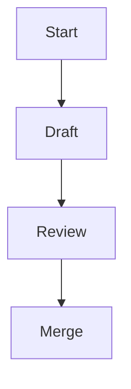

# Documentation style guide

This guide outlines conventions for authoring documentation for Concordat.
Apply these rules to keep the documentation clear and consistent for developers.

## Spelling

- Use British English based on the
  [Oxford English Dictionary](https://public.oed.com/) locale `en-GB-oxendict`,
  which   denotes English for the Great Britain market in the Oxford style:
  - suffix -ize in words like _realize_ and _organization_ instead of
     -ise endings,
  - suffix ‑lyse in words not traced to the Greek ‑izo, ‑izein suffixes,
     such as _analyse_, _paralyse_ and _catalyse_,
  - suffix -our in words such as _colour_, _behaviour_ and _neighbour_,
  - suffix -re in words such as _calibre_, _centre_ and _fibre_,
  - double "l" in words such as _cancelled_, _counsellor_ and _cruellest_,
  - maintain the "e" in words such as _likeable_, _liveable_ and _rateable_,
  - suffix -ogue in words such as _analogue_ and _catalogue_,
  - and so forth.
- The word **"outwith"** is acceptable.
- Keep United States (US) spelling when used in an API, for example, `color`.
- The project uses the filename `LICENSE` for community consistency.

## Punctuation and grammar

- Use the Oxford comma: "ships, planes, and hovercraft" where it aids
  comprehension.
- Company names are treated as collective nouns: "Concordat Industries are
  expanding".
- Avoid first and second person personal pronouns outside the `README.md`
  file.

## Headings

- Write headings in sentence case.
- Use Markdown headings (`#`, `##`, `###`, and so on) in order without skipping
  levels.

## Markdown rules

- Follow [markdownlint](https://github.com/DavidAnson/markdownlint)
  recommendations[^1].
- Provide code blocks and lists using standard Markdown syntax.
- Always provide a language identifier for fenced code blocks; use `plaintext`
  for non-code text.
- Use `-` as the first level bullet and renumber lists when items change.
- Prefer inline links using `[text](url)` or angle brackets around the URL.
- Ensure blank lines before and after bulleted lists and fenced blocks.
- Ensure tables have a delimiter line below the header row.

## Expanding acronyms

- Expand any uncommon acronym on first use, for example, Continuous Integration
  (CI).

## Formatting

- Wrap paragraphs at 80 columns.
- Wrap code at 120 columns.
- Do not wrap tables.
- Use GitHub-flavoured numeric footnotes referenced as `[^1]`.
- Footnotes must be numbered in order of appearance in the document.
- Caption every table, and caption every diagram.

## Example snippet

```rust,no_run
/// A simple function demonstrating documentation style.
fn add(a: i32, b: i32) -> i32 {
    a + b
}
```

## API doc comments (Rust)

Use doc comments to document public APIs. Keep them consistent with the
contents of the manual.

- Begin each block with `///`.
- Keep the summary line short, followed by further detail.
- Explicitly document all parameters with `# Parameters`, describing each
  argument.
- Document the return value with `# Returns`.
- Document any panics or errors with `# Panics` or `# Errors` as appropriate.
- Place examples under `# Examples` and mark the code block with `no_run`, so
  they do not execute during documentation tests.
- Put function attributes after the doc comment.

```rust,no_run
/// Returns the sum of `a` and `b`.
///
/// # Parameters
/// - `a`: The first integer to add.
/// - `b`: The second integer to add.
///
/// # Returns
/// The sum of `a` and `b`.
///
/// # Examples
///
/// ```rust,no_run
/// assert_eq!(add(2, 3), 5);
/// ```
#[inline]
pub fn add(a: i32, b: i32) -> i32 {
    a + b
}
```

## Diagrams and images

Where it adds clarity, include [Mermaid](https://mermaid.js.org/) diagrams.
When embedding figures, use `` and provide brief alt
text describing the content. Add a short description before each Mermaid
diagram, so screen readers can understand it.

For screen readers: The following flowchart outlines the documentation workflow.



_Figure 1: Documentation workflow from draft through merge review._

## Roadmap task writing guidelines

When documenting development roadmap items, write them to be achievable,
measurable, and structured. This ensures the roadmap functions as a practical
planning tool rather than a vague wishlist. Do not commit to timeframes in the
roadmap. Development effort should be roughly consistent from task to task.

### Principles for roadmap tasks

- Define outcomes, not intentions: Phrase tasks in terms of the capability
  delivered (e.g. “Implement role-based access control for API endpoints”), not
  aspirations like “Improve security”.
- Quantify completion criteria: Attach measurable finish lines (e.g. “90%
  test coverage for new modules”, “response times under 200ms”, “all endpoints
  migrated”).
- Break into atomic increments: Ensure tasks can be completed in weeks, not
  quarters. Large goals should be decomposed into clear, deliverable units.
- Tie to dependencies and sequencing: Document prerequisites, so tasks can be
  scheduled realistically (e.g. “Introduce central logging service” before “Add
  error dashboards”).
- Bound scope explicitly: Note both in-scope and out-of-scope elements (e.g.
  “Build analytics dashboard (excluding churn prediction)”).

### Hierarchy of scope

Roadmaps should be expressed in three layers of scope to maintain clarity and
navigability:

- Phases (strategic milestones) – Broad outcome-driven stages that represent
  significant capability shifts. Why the work matters.
- Steps (epics / workstreams) – Mid-sized clusters of related tasks grouped
  under a phase. What will be built.
- Tasks (execution units) – Small, measurable pieces of work with clear
  acceptance criteria. How it gets done.

______________________________________________________________________

[^1]: A linter that enforces consistent Markdown formatting.
