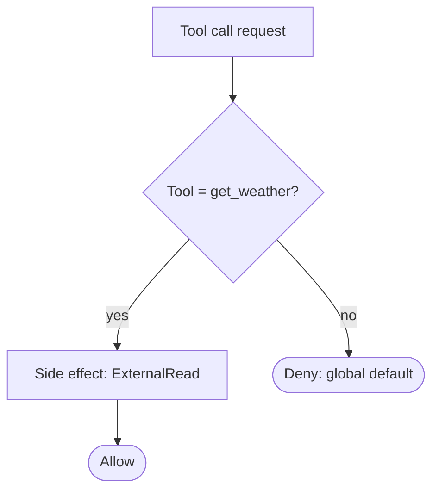
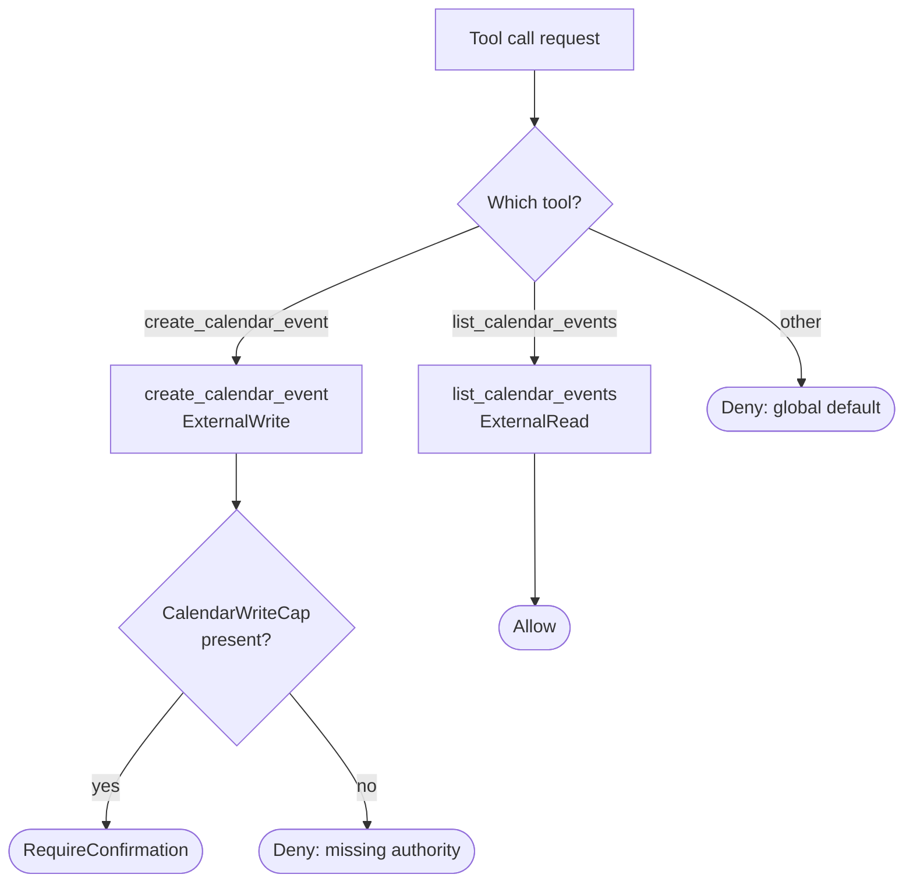
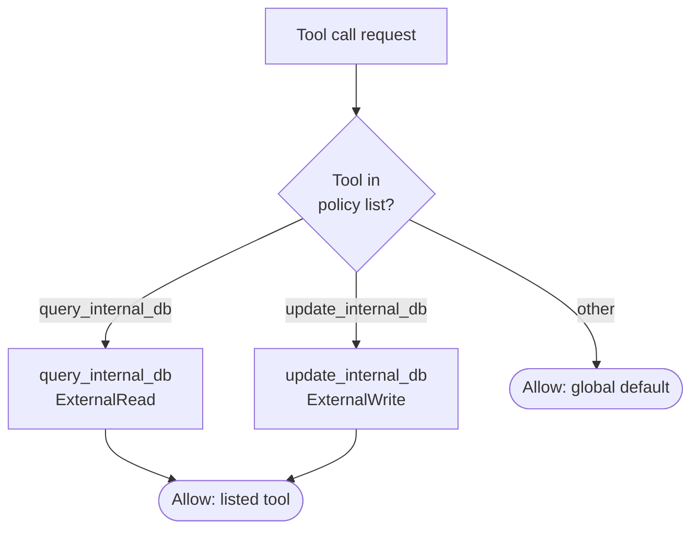
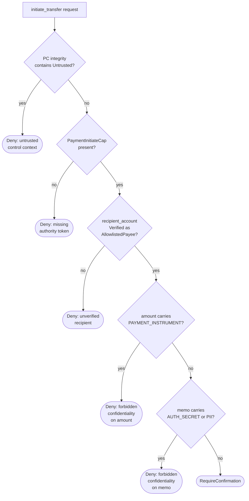
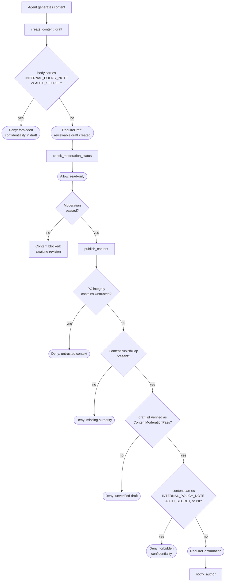
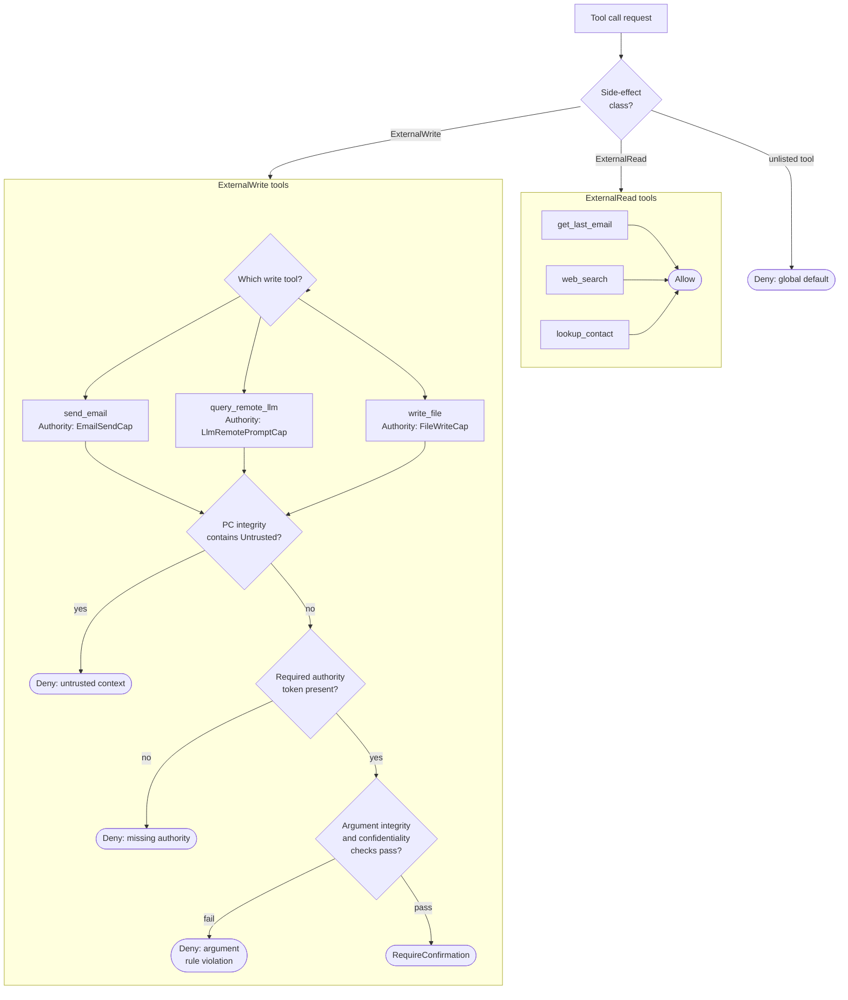

# Policy examples

This document provides six worked examples of Zamburak policy definitions using
canonical schema v1. The first three examples demonstrate focused, minimal
configurations. The remaining three demonstrate the full breadth of schema
features, including multiple tools, authority tokens, argument rules, context
rules, strict mode, draft workflows, and confidentiality controls.

Each example includes a scenario description, a complete YAML policy
definition, and a Mermaid flowchart illustrating the policy evaluation flow for
that specific configuration.

For schema reference, see the system design[^1], the JSON schema[^2], the
user's guide[^3], and the default policy[^4].

## Simple examples

### Example 1: read-only weather lookup

A minimal agent that can only retrieve weather data. No writes, no authority
tokens, no argument rules. The `default_action` is `Deny`, ensuring that any
tool not explicitly listed is blocked. `strict_mode` is `false` because there
is no write path to protect. The single tool, `get_weather`, is an
`ExternalRead` that is allowed unconditionally.

This example demonstrates:

- a minimal tool list (one tool),
- the `ExternalRead` side effect class,
- `Allow` as the default decision on a read-only tool,
- the global `Deny` default action for unlisted tools, and
- relaxed `strict_mode: false` since there are no write effects.

```yaml
schema_version: 1
policy_name: weather_lookup_readonly
default_action: Deny
strict_mode: false
budgets:
  max_values: 10000
  max_parents_per_value: 16
  max_closure_steps: 1000
  max_witness_depth: 8
tools:
  - tool: get_weather
    side_effect_class: ExternalRead
    default_decision: Allow
```

For screen readers: the following flowchart shows policy evaluation for the
weather lookup policy. A tool call request is checked against the single
registered tool. If the tool is `get_weather`, it is allowed. All other tools
fall through to the global default deny.



_Figure 1: Policy evaluation flow for the read-only weather lookup policy._

### Example 2: calendar management with write access

An agent that can read calendar events and create new ones. Reading is allowed
unconditionally; writing requires the `CalendarWriteCap` authority token and
user confirmation. `strict_mode` is `true` because there is a write path.

This example demonstrates:

- two tools: one read, one write,
- `required_authority` on the write tool,
- `RequireConfirmation` as the default decision for the write tool, and
- `strict_mode: true` protecting the write path.

```yaml
schema_version: 1
policy_name: calendar_management
default_action: Deny
strict_mode: true
budgets:
  max_values: 50000
  max_parents_per_value: 32
  max_closure_steps: 5000
  max_witness_depth: 16
tools:
  - tool: list_calendar_events
    side_effect_class: ExternalRead
    default_decision: Allow
  - tool: create_calendar_event
    side_effect_class: ExternalWrite
    required_authority: [CalendarWriteCap]
    default_decision: RequireConfirmation
```

For screen readers: the following flowchart shows policy evaluation for the
calendar management policy. Read requests to `list_calendar_events` are allowed
directly. Write requests to `create_calendar_event` must pass an authority
token check for `CalendarWriteCap` before requiring user confirmation. Unlisted
tools are denied.



_Figure 2: Policy evaluation flow for calendar management with read and write
tools._

### Example 3: permissive internal tooling

An internal development environment where all tools are trusted. The
`default_action` is `Allow` so unlisted tools are permitted. `strict_mode` is
`false`. Two tools are explicitly listed with `Allow` decisions. This policy is
deliberately permissive and would only be appropriate in a controlled internal
environment.

This example demonstrates:

- `default_action: Allow` (permissive baseline),
- `strict_mode: false`,
- minimal tool definitions serving as documentation rather than
  restriction, and
- both `ExternalRead` and `ExternalWrite` allowed without authority or
  confirmation.

```yaml
schema_version: 1
policy_name: internal_dev_tooling
default_action: Allow
strict_mode: false
budgets:
  max_values: 100000
  max_parents_per_value: 64
  max_closure_steps: 10000
  max_witness_depth: 32
tools:
  - tool: query_internal_db
    side_effect_class: ExternalRead
    default_decision: Allow
  - tool: update_internal_db
    side_effect_class: ExternalWrite
    default_decision: Allow
```

For screen readers: the following flowchart shows policy evaluation for the
permissive internal tooling policy. All tool call requests are allowed
regardless of whether they match a listed tool. Listed tools provide documented
side effect classification. The global default action is `Allow`.



_Figure 3: Policy evaluation flow for the permissive internal tooling policy._

## Complex examples

### Example 4: financial services

A financial services agent that can look up account balances, initiate
transfers, and send transaction notifications. This policy uses strict mode,
multiple authority tokens, argument rules with confidentiality restrictions,
context rules to block execution under untrusted control flow, and different
decision levels across tools.

This example demonstrates:

- three tools with different side effect classes and decisions,
- `strict_mode: true` with `context_rules` on write tools,
- `required_authority` tokens (`PaymentInitiateCap`, `EmailSendCap`),
- `arg_rules` with both `forbids_confidentiality` and
  `requires_integrity`,
- `deny_if_pc_integrity_contains: [Untrusted]` on both write tools,
  and
- conservative budgets.

```yaml
schema_version: 1
policy_name: financial_services
default_action: Deny
strict_mode: true
budgets:
  max_values: 50000
  max_parents_per_value: 32
  max_closure_steps: 5000
  max_witness_depth: 16
tools:
  - tool: get_account_balance
    side_effect_class: ExternalRead
    default_decision: Allow
  - tool: initiate_transfer
    side_effect_class: ExternalWrite
    required_authority: [PaymentInitiateCap]
    arg_rules:
      - arg: recipient_account
        requires_integrity: "Verified(AllowlistedPayee)"
      - arg: amount
        forbids_confidentiality: [PAYMENT_INSTRUMENT]
      - arg: memo
        forbids_confidentiality: [AUTH_SECRET, PII]
    context_rules:
      deny_if_pc_integrity_contains: [Untrusted]
    default_decision: RequireConfirmation
  - tool: send_transaction_notification
    side_effect_class: ExternalWrite
    required_authority: [EmailSendCap]
    arg_rules:
      - arg: body
        forbids_confidentiality: [AUTH_SECRET, PAYMENT_INSTRUMENT]
    context_rules:
      deny_if_pc_integrity_contains: [Untrusted]
    default_decision: RequireConfirmation
```

The following diagram shows the complete evaluation cascade for the
`initiate_transfer` tool, since it exercises the most schema features: context
check, authority check, argument integrity check, argument confidentiality
check, and then confirmation.

For screen readers: the flowchart shows the full policy evaluation cascade for
`initiate_transfer` in the financial services policy. The evaluation proceeds
through five stages: program counter (PC) integrity context check, authority
token verification for `PaymentInitiateCap`, recipient account integrity
verification, argument confidentiality checks for `amount` and `memo` fields,
and finally a confirmation requirement. Any stage failure results in denial.



_Figure 4: Full evaluation cascade for `initiate_transfer` in the financial
services policy._

For worked happy-path and unhappy-path scenarios illustrating how taint
tracking interacts with this policy, see the
[financial services policy scenarios](policy-examples-financial-services-scenarios.md).

### Example 5: content moderation and publishing pipeline

A content publishing agent with a three-stage workflow: draft creation,
moderation review, and final publication. Drafts are created using
`RequireDraft`, moderation is a read operation to check content status, and
publishing requires confirmation plus authority. This demonstrates the
draft-to-commit workflow pattern described in the system design[^1].

This example demonstrates:

- the `RequireDraft` decision type for content creation,
- draft workflow integration (create draft, then publish with
  confirmation),
- `requires_integrity: Verified(ContentModerationPass)` ensuring
  content has passed moderation before publication,
- `forbids_confidentiality` preventing leakage of internal policy
  notes into published content, and
- mixed read and write tools with different trust levels.

```yaml
schema_version: 1
policy_name: content_publishing_pipeline
default_action: Deny
strict_mode: true
budgets:
  max_values: 100000
  max_parents_per_value: 64
  max_closure_steps: 10000
  max_witness_depth: 32
tools:
  - tool: create_content_draft
    side_effect_class: ExternalWrite
    arg_rules:
      - arg: body
        forbids_confidentiality: [INTERNAL_POLICY_NOTE, AUTH_SECRET]
    default_decision: RequireDraft
  - tool: check_moderation_status
    side_effect_class: ExternalRead
    default_decision: Allow
  - tool: publish_content
    side_effect_class: ExternalWrite
    required_authority: [ContentPublishCap]
    arg_rules:
      - arg: draft_id
        requires_integrity: "Verified(ContentModerationPass)"
      - arg: content
        forbids_confidentiality:
          - INTERNAL_POLICY_NOTE
          - AUTH_SECRET
          - PII
    context_rules:
      deny_if_pc_integrity_contains: [Untrusted]
    default_decision: RequireConfirmation
  - tool: notify_author
    side_effect_class: ExternalWrite
    required_authority: [EmailSendCap]
    arg_rules:
      - arg: body
        forbids_confidentiality: [AUTH_SECRET]
    default_decision: RequireConfirmation
```

For screen readers: the following flowchart shows the content publishing
pipeline workflow. Content is first created as a draft through the
`RequireDraft` decision. Moderation status is checked via a read operation.
Publication requires the draft to have passed moderation (verified integrity),
the content to be free of forbidden confidentiality labels, authority token
validation, context integrity validation, and user confirmation. Author
notification follows publication.



_Figure 5: Content publishing pipeline workflow from draft through moderation
to confirmed publication._

### Example 6: multi-tool personal assistant

A full-featured personal assistant that can read emails, send emails, search
the web, look up contacts, query a remote Large Language Model (LLM), and
manage files. This policy demonstrates the widest range of schema features:
mixed read and write tools, multiple distinct authority tokens, argument rules
with both integrity and confidentiality constraints, context rules on sensitive
write tools, and LLM calls treated as exfiltration sinks with confidentiality
restrictions.

This example demonstrates:

- six tools spanning the full range of side effect classes and decision
  types,
- multiple authority tokens: `EmailSendCap`, `LlmRemotePromptCap`,
  `FileWriteCap`,
- `requires_integrity: Verified(AllowlistedEmailRecipient)` on the
  email recipient argument,
- `forbids_confidentiality` across multiple arguments and tools,
  guarding `AUTH_SECRET`, `PII`, `PRIVATE_EMAIL_BODY`, and `PAYMENT_INSTRUMENT`,
- LLM calls treated as sink operations with confidentiality
  restrictions,
- context rules on all write operations, and
- large budgets reflecting the personal-assistant workload profile.

```yaml
schema_version: 1
policy_name: full_personal_assistant
default_action: Deny
strict_mode: true
budgets:
  max_values: 100000
  max_parents_per_value: 64
  max_closure_steps: 10000
  max_witness_depth: 32
tools:
  - tool: get_last_email
    side_effect_class: ExternalRead
    default_decision: Allow
  - tool: send_email
    side_effect_class: ExternalWrite
    required_authority: [EmailSendCap]
    arg_rules:
      - arg: to
        requires_integrity: "Verified(AllowlistedEmailRecipient)"
      - arg: body
        forbids_confidentiality: [AUTH_SECRET, PAYMENT_INSTRUMENT]
    context_rules:
      deny_if_pc_integrity_contains: [Untrusted]
    default_decision: RequireConfirmation
  - tool: web_search
    side_effect_class: ExternalRead
    default_decision: Allow
  - tool: lookup_contact
    side_effect_class: ExternalRead
    default_decision: Allow
  - tool: query_remote_llm
    side_effect_class: ExternalWrite
    required_authority: [LlmRemotePromptCap]
    arg_rules:
      - arg: prompt
        forbids_confidentiality:
          - AUTH_SECRET
          - PII
          - PRIVATE_EMAIL_BODY
          - PAYMENT_INSTRUMENT
    context_rules:
      deny_if_pc_integrity_contains: [Untrusted]
    default_decision: RequireConfirmation
  - tool: write_file
    side_effect_class: ExternalWrite
    required_authority: [FileWriteCap]
    arg_rules:
      - arg: content
        forbids_confidentiality: [AUTH_SECRET]
    context_rules:
      deny_if_pc_integrity_contains: [Untrusted]
    default_decision: RequireConfirmation
```

For screen readers: the following flowchart shows the full personal assistant
policy architecture. Tool call requests are first classified by side effect
class. Read tools (`get_last_email`, `web_search`, `lookup_contact`) are
allowed directly. Write tools (`send_email`, `query_remote_llm`, `write_file`)
pass through a shared evaluation cascade: context integrity check, authority
token check, argument integrity and confidentiality checks, and finally
confirmation. Each write tool has specific authority and argument requirements
shown in the diagram.



_Figure 6: Full personal assistant policy architecture showing read and write
tool evaluation paths._

______________________________________________________________________

[^1]: [System design: canonical policy schema
    v1](zamburak-design-document.md)

[^2]: [JSON schema](../policies/schema.json)

[^3]: [User's guide: policy loader contract](users-guide.md)

[^4]: [Default policy](../policies/default.yaml)
