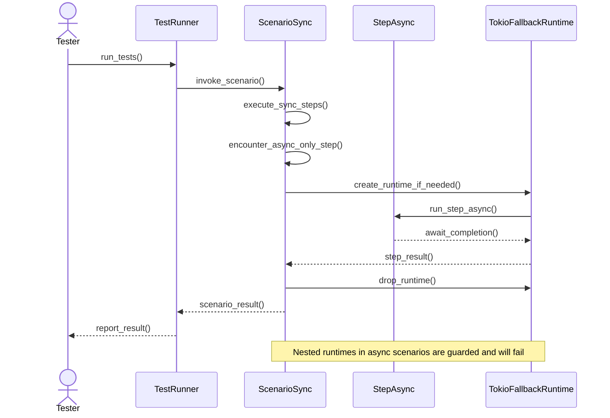

# `rstest-bdd` user's guide

## Introduction

Behaviour‑Driven Development (BDD) is a collaborative practice that emphasizes
a shared understanding of software behaviour across roles. The design of
`rstest‑bdd` integrates BDD concepts with the Rust testing ecosystem. BDD
encourages collaboration between developers, quality-assurance specialists, and
non-technical business participants by describing system behaviour in a
natural, domain‑specific language. `rstest‑bdd` achieves this without
introducing a bespoke test runner; instead, it builds on the `rstest` crate so
that unit tests and high‑level behaviour tests can co‑exist and run under
`cargo test`. The framework reuses `rstest` fixtures for dependency injection
and uses a procedural macro to bind tests to Gherkin scenarios, ensuring that
functional tests live alongside unit tests and benefit from the same tooling.

This guide explains how to consume `rstest‑bdd` at the current stage of
development. It relies on the implemented code rather than on aspirational
features described in the design documents. Where the design proposes advanced
behaviour, the implementation status is noted. Examples and explanations are
organized by the so‑called *three amigos* of BDD: the business analyst/product
owner, the developer, and the tester.

## Toolchain requirements

`rstest-bdd` targets Rust 1.85 or newer across every crate in the workspace.
Each `Cargo.toml` declares `rust-version = "1.85"`, so `cargo` will refuse to
compile the project on older compilers. The workspace uses the Rust 2024
edition.

`rstest-bdd` builds on stable Rust. The repository pins a stable toolchain for
development via `rust-toolchain.toml` so contributors get consistent `rustfmt`
and `clippy` behaviour.

Step definitions may be synchronous functions (`fn`) or asynchronous functions
(`async fn`). The framework no longer depends on the `async-trait` crate to
express async methods in traits. Projects that previously relied on
`#[async_trait]` in helper traits should replace those methods with ordinary
functions, and use async steps or async fixtures where appropriate. Step
wrappers normalize results into `StepExecution`.

## The three amigos

| Role ("amigo")                     | Primary concerns                                                                                                                  | Features provided by `rstest‑bdd`                                                                                                                                                                                                                                                                                                                                                                         |
| ---------------------------------- | --------------------------------------------------------------------------------------------------------------------------------- | --------------------------------------------------------------------------------------------------------------------------------------------------------------------------------------------------------------------------------------------------------------------------------------------------------------------------------------------------------------------------------------------------------- |
| **Business analyst/product owner** | Writing and reviewing business-readable specifications; ensuring that acceptance criteria are expressed clearly.                  | Gherkin `.feature` files are plain text and start with a `Feature` declaration; each `Scenario` describes a single behaviour. Steps are written using keywords `Given`, `When`, and `Then` ([syntax](gherkin-syntax.md#L72-L91)), producing living documentation that can be read by non-technical stakeholders.                                                                                          |
| **Developer**                      | Implementing step definitions in Rust and wiring them to the business specifications; using existing fixtures for setup/teardown. | Attribute macros `#[given]`, `#[when]` and `#[then]` register step functions and their pattern strings in a global step registry. A `#[scenario]` macro reads a feature file at compile time and generates a test that drives the registered steps. Fixtures whose parameter names match are injected automatically; use `#[from(name)]` only when a parameter name differs from the fixture.             |
| **Tester/QA**                      | Executing behaviour tests, ensuring correct sequencing of steps and verifying outcomes observable by the user.                    | Scenarios are executed via the standard `cargo test` runner; test functions annotated with `#[scenario]` run each step in order and panic if a step is missing. Assertions belong in `Then` steps; guidelines discourage inspecting internal state and encourage verifying observable outcomes. Testers can use `cargo test` filters and parallelism because the generated tests are ordinary Rust tests. |

The following sections expand on these responsibilities and show how to use the
current API effectively.

## Gherkin feature files

Gherkin files describe behaviour in a structured, plain‑text format that can be
read by both technical and non‑technical stakeholders. Each `.feature` file
begins with a `Feature` declaration that provides a high‑level description of
the functionality. A feature contains one or more `Scenario` sections, each of
which documents a single example of system behaviour. Inside a scenario, the
behaviour is expressed through a sequence of steps starting with `Given`
(context), followed by `When` (action) and ending with `Then` (expected
outcome). Secondary keywords `And` and `But` may chain additional steps of the
same type for readability.

Scenarios follow the simple `Given‑When‑Then` pattern. Support for **Scenario
Outline** is available, enabling a single scenario to run with multiple sets of
data from an `Examples` table. A `Background` section defines steps that run
before each `Scenario` in a feature file, enabling shared setup across
scenarios. Advanced constructs such as data tables and doc strings provide
structured or free‑form arguments to steps.

### Example feature file

```gherkin
Feature: Shopping basket

  Scenario: Add item to basket
    Given an empty basket
    When the user adds a pumpkin
    Then the basket contains one pumpkin
```

The feature file lives within the crate (commonly under `tests/features/`). The
path to this file will be referenced by the `#[scenario]` macro in the test
code.

### Internationalised scenarios

`rstest-bdd` reads the optional `# language: <code>` directive that appears at
the top of a feature file. When a locale is specified, the parser uses that
language's keyword catalogue, enabling teams to collaborate in their native
language. The `examples/japanese-ledger` crate demonstrates the end-to-end
workflow for Japanese:

```gherkin
# language: ja
フィーチャ: 家計簿の残高を管理する
  シナリオ: 収入を記録する
    前提 残高は0である
    もし 残高に5を加える
    ならば 残高は5である
```

Step definitions use the same Unicode phrases:

```rust,no_run
use japanese_ledger::HouseholdLedger;
use rstest_bdd_macros::{given, when, then};

#[given("残高は{start:i32}である")]
fn starting_balance(ledger: &HouseholdLedger, start: i32) {
    ledger.set_balance(start);
}
```

Running `cargo test -p japanese-ledger` executes both Japanese scenarios. The
full source lives under `examples/japanese-ledger/` for teams that want to copy
the structure into their projects.

## Step definitions

Developers implement the behaviour described in a feature by writing step
definition functions in Rust. Each step definition is an ordinary function
annotated with one of the attribute macros `#[given]`, `#[when]` or `#[then]`.
The annotation takes a single string literal that must match the text of the
corresponding step in the feature file. Placeholders in the form `{name}` or
`{name:Type}` are supported. The framework extracts matching substrings and
converts them using `FromStr`; type hints constrain the match using specialized
regular expressions. If the step text does not supply a capture for a declared
argument, the wrapper panics with
`pattern '<pattern>' missing capture for argument '<name>'`, making the
mismatch explicit.

For cucumber-rs migration compatibility notes, see
[Migration and async patterns](cucumber-rs-migration-and-async-patterns.md).

The procedural macro implementation expands the annotated function into two
parts: the original function and a wrapper function that registers the step in
a global registry. The wrapper captures the step keyword, pattern string and
associated fixtures and uses the `inventory` crate to publish them for later
lookup.

### Fixtures and implicit injection

`rstest‑bdd` builds on `rstest`’s fixture system rather than using a monolithic
“world” object. Fixtures are defined using `#[rstest::fixture]` in the usual
way. When a step function parameter does not correspond to a placeholder in the
step pattern, the macros treat it as a fixture and inject the value
automatically. The optional `#[from(name)]` attribute remains available when a
parameter name must differ from the fixture. Importing a symbol of the same
name is not required; do not alias a function or item just to satisfy the
compiler. Only the key stored in `StepContext` must match.

Internally, the step macros record the fixture names and generate wrapper code
that, at runtime, retrieves references from a `StepContext`. This context is a
key–value map of fixture names to type‑erased references. When a scenario runs,
the generated test inserts its arguments (the `rstest` fixtures) into the
`StepContext` before invoking each registered step.

### Mutable world fixtures

Each scenario owns its fixtures, so value fixtures are stored with exclusive
access. Step parameters declared as `&mut FixtureType` receive mutable
references, making “world” structs ergonomic without sprinkling `Cell` or
`RefCell` wrappers through the fields. Immutable references continue to work
exactly as before; mutability is an opt‑in convenience.

**When to use `&mut Fixture`**

- Prefer `&mut` when the world has straightforward owned fields and the steps
  mutate them directly.
- Prefer `Slot<T>` (from `rstest_bdd::Slot`) when state is optional, when a
  need to reset between steps, or when a step may override values conditionally
  without holding a mutable borrow.
- Combine both: keep the primary world mutable and store optional or
  late‑bound values in slots to avoid borrow checker churn inside complex
  scenarios.

#### Simple mutable world

```rust,no_run
use rstest::fixture;
use rstest_bdd_macros::{given, scenario, then, when};

#[derive(Default)]
struct CounterWorld {
    count: usize,
}

#[fixture]
fn world() -> CounterWorld {
    CounterWorld::default()
}

#[given("the world starts at {value}")]
fn seed(world: &mut CounterWorld, value: usize) {
    world.count = value;
}

#[when("the world increments")]
fn increment(world: &mut CounterWorld) {
    world.count += 1;
}

#[then("the world equals {expected}")]
fn check(world: &CounterWorld, expected: usize) {
    assert_eq!(world.count, expected);
}

#[scenario(path = "tests/features/mutable_world.feature", name = "Steps mutate shared state")]
fn mutable_world(world: CounterWorld) {
    assert_eq!(world.count, 3);
}
```

#### Slot‑based state (unchanged and still useful)

```rust,no_run
use rstest::fixture;
use rstest_bdd::{ScenarioState as _, Slot};
use rstest_bdd_macros::{given, scenario, then, when, ScenarioState};

#[derive(Default, ScenarioState)]
struct CartState {
    total: Slot<i32>,
}

#[fixture]
fn cart_state() -> CartState { CartState::default() }

#[when("I record {value:i32}")]
fn record(cart_state: &CartState, value: i32) { cart_state.total.set(value); }

#[then("the recorded value is {expected:i32}")]
fn check(cart_state: &CartState, expected: i32) {
    assert_eq!(cart_state.total.get(), Some(expected));
}

#[scenario(path = "tests/features/scenario_state.feature", name = "Recording a single value")]
fn keeps_value(_cart_state: CartState) {}
```

#### Mixed approach

```rust,no_run
#[derive(Default, ScenarioState)]
struct ReportWorld {
    total: usize,
    last_input: Slot<String>,
}

#[when("the total increases by {value:usize}")]
fn bump(world: &mut ReportWorld, value: usize) {
    world.total += value;
    world.last_input.set(format!("+{value}"));
}

#[then("the last input was recorded")]
fn last_input(world: &ReportWorld) {
    assert_eq!(world.last_input.get(), Some("+1".to_string()));
}
```

#### Best practices

- Keep world structs small and focused; extract helper methods when mutation
  requires validation or cross‑field consistency.
- Prefer immutable references in assertions to make read‑only intent obvious.
- Reserve `Slot<T>` for optional or resettable state; avoid mixing it in when a
  plain field would do.
- Add comments where mutation order matters between steps.

#### Troubleshooting

- A rustc internal compiler error (ICE) affected some nightly compilers when
  expanding macro‑driven scenarios with `&mut` fixtures. See
  `crates/rstest-bdd/tests/mutable_world_macro.rs` for a guarded example and
  `crates/rstest-bdd/tests/mutable_fixture.rs` for the context‑level regression
  test used until the upstream fix lands. Tracking details live in
  `docs/known-issues.md#rustc-ice-with-mutable-world-macro`.
- For advanced cases—custom fixture injection or manual borrowing—use
  `StepContext::insert_owned` and `StepContext::borrow_mut` directly; the
  examples above cover most scenarios.

### Step return values

`#[when]` steps may return a value. The scenario runner scans the available
fixtures for ones whose `TypeId` matches the returned value. When exactly one
fixture uses that type, the override is recorded under that fixture’s name and
subsequent steps receive the most recent value (last write wins). Ambiguous or
missing matches leave fixtures untouched, keeping scenarios predictable while
still allowing a functional style without mutable fixtures.

Steps may also return `Result<T, E>`. An `Err` aborts the scenario, while an
`Ok` value is injected as above.

The step macros recognize these `Result` shapes during expansion:

- `Result<..>`, `std::result::Result<..>`, and `core::result::Result<..>`
- `rstest_bdd::StepResult<..>` (an alias provided by the runtime crate)

When inference cannot determine whether a return type is a `Result` (for
example, when returning a type alias), prefer returning
`rstest_bdd::StepResult` or spelling out `Result<..>` in the signature.
Alternatively, add an explicit return-kind hint: `#[when(result)]` /
`#[when(value)]`.

The `result`/`value` hints are validated for obvious misconfigurations.
`result` is rejected for primitive return types. For aliases, the macro cannot
validate the underlying definition and assumes `Result<..>` semantics.

Use `#[when("...", value)]` (or `#[when(value)]` when using the inferred
pattern) to force treating the return value as a payload even when it is
`Result<..>`.

Returning `()` or `Ok(())` produces no stored value, so fixtures of `()` are
not overwritten.

```rust,no_run
use rstest::fixture;
use rstest_bdd_macros::{given, when, then, scenario};

#[fixture]
fn number() -> i32 { 1 }

#[when("it is incremented")]
fn increment(number: i32) -> i32 { number + 1 }

#[then("the result is 2")]
fn check(number: i32) { assert_eq!(number, 2); }

#[scenario(path = "tests/features/step_return.feature")]
fn returns_value(number: i32) { let _ = number; }
```

### Struct-based step arguments

When a step pattern contains several placeholders, the corresponding function
signatures quickly become unwieldy. Derive the `StepArgs` trait for a struct
whose fields mirror the placeholders and annotate the relevant parameter with
`#[step_args]` to request struct-based parsing. The attribute tells the macro
to consume every placeholder for that parameter, while fixtures and other
special arguments (`datatable`/`docstring`) continue to work as usual.

Fields must implement `FromStr`, and the derive macro enforces the bounds
automatically. Placeholders and struct fields must appear in the same order.
During expansion the macro inserts a compile-time check to ensure the field
count matches the pattern, producing a trait-bound error if the struct does not
implement `StepArgs`.

```rust,no_run
use rstest::fixture;
use rstest_bdd_macros::{given, scenario, then, when, StepArgs};

#[derive(StepArgs)]
struct CartInput {
    quantity: u32,
    item: String,
    price: f32,
}

#[derive(Default)]
struct Cart {
    quantity: u32,
    item: String,
    price: f32,
}

impl Cart {
    fn set(&mut self, details: &CartInput) {
        self.quantity = details.quantity;
        self.item = details.item.clone();
        self.price = details.price;
    }
}

#[fixture]
fn cart() -> Cart { Cart::default() }

#[given("a cart containing {quantity:u32} {item} at ${price:f32}")]
fn seed_cart(#[step_args] details: CartInput, cart: &mut Cart) {
    cart.set(&details);
}

#[then("the cart summary shows {quantity:u32} {item} at ${price:f32}")]
fn cart_summary(#[step_args] expected: CartInput, cart: &Cart) {
    assert_eq!(cart.quantity, expected.quantity);
    assert_eq!(cart.item, expected.item);
    assert!((cart.price - expected.price).abs() < f32::EPSILON);
}
```

`#[step_args]` must not be combined with `#[from]` and cannot target reference
types because the macro needs to own the struct to parse it. Attempting to use
multiple `#[step_args]` parameters in a single step yields a compile-time
error. The compiler also surfaces an error when the step pattern does not
declare any placeholders.

Example:

```rust,no_run
use rstest::fixture;
use rstest_bdd_macros::{given, when, then, scenario};

// A fixture used by multiple steps.
#[fixture]
fn basket() -> Basket {
    Basket::new()
}

#[given("an empty basket")]
fn empty_basket(basket: &mut Basket) {
    basket.clear();
}

#[when("the user adds a pumpkin")]
fn add_pumpkin(basket: &mut Basket) {
    basket.add(Item::Pumpkin, 1);
}

#[then("the basket contains one pumpkin")]
fn assert_pumpkins(basket: &Basket) {
    assert_eq!(basket.count(Item::Pumpkin), 1);
}

#[scenario(path = "tests/features/shopping.feature")]
fn test_add_to_basket(#[with(basket)] _: Basket) {
    // optional assertions after the steps
}
```

### Scenario state slots

Complex scenarios often need to capture intermediate results or share mutable
state between multiple steps. Historically, this required wrapping every field
in `RefCell<Option<T>>`, introducing noise and risking forgotten resets. The
`rstest-bdd` runtime now provides `Slot<T>`, a thin wrapper that exposes a
focused API for populating, reading, and clearing per-scenario values. Each
slot starts empty and supports helpers such as `set`, `replace`,
`get_or_insert_with`, `take`, and predicates `is_empty`/`is_filled`.

Define a state struct whose fields are `Slot<T>` and derive [`ScenarioState`].
The derive macro clears every slot by implementing `ScenarioState::reset` and
it automatically adds a [`Default`] implementation that leaves all slots empty.
**Do not** also derive or implement `Default`: Rust will report a
duplicate-implementation error because the macro already provides it. For
custom initialization, plan to use the future `#[scenario_state(no_default)]`
flag (or equivalent) to opt out of the generated `Default` and supply bespoke
logic.

```rust,no_run
use rstest::fixture;
use rstest_bdd::{ScenarioState, Slot};
use rstest_bdd_macros::{given, scenario, then, when, ScenarioState};

#[derive(ScenarioState)]
struct CliState {
    output: Slot<String>,
    exit_code: Slot<i32>,
}

#[fixture]
fn cli_state() -> CliState {
    CliState::default()
}

#[when("I run the CLI with {word}")]
fn run_command(cli_state: &CliState, argument: String) {
    let result = format!("ran {argument}");
    cli_state.output.set(result);
    cli_state.exit_code.set(0);
}

#[then("the CLI succeeded")]
fn cli_succeeded(cli_state: &CliState) {
    assert_eq!(cli_state.exit_code.get(), Some(0));
}

#[then("I can reset the state")]
fn reset_state(cli_state: &CliState) {
    cli_state.reset();
    assert!(cli_state.output.is_empty());
}

#[scenario(path = "tests/features/cli.feature")]
fn cli_behaviour(_cli_state: CliState) {}
```

Slots are independent, so scenarios can freely mix eager `set` calls with lazy
`get_or_insert_with` initializers. Because slots live inside a regular fixture,
the state benefits from `rstest`’s usual lifecycle: a fresh struct is produced
for each scenario invocation, yet it remains trivial to clear and reuse the
contents when chaining multiple behaviours inside a single test body.

### Implicit fixture injection

Implicit fixtures such as `basket` must already be in scope in the test module;
`#[from(name)]` only renames a fixture and does not create one.

In this example, the step texts in the annotations must match the feature file
verbatim. The `#[scenario]` macro binds the test function to the first scenario
in the specified feature file and runs all registered steps before executing
the body of `test_add_to_basket`.

### Inferred step patterns

Step macros may omit the pattern string or provide a string literal containing
only whitespace. In either case, the macro derives a pattern from the function
name by replacing underscores with spaces.

```rust,no_run
use rstest_bdd_macros::given;

#[given]
fn user_logs_in() {
    // pattern "user logs in" is inferred
}
```

This reduces duplication between function names and patterns. A literal `""`
registers an empty pattern instead of inferring one.

> Note
> Inference preserves spaces derived from underscores:
>
> - Leading and trailing underscores become leading or trailing spaces.
> - Consecutive underscores become multiple spaces.
> - Letter case is preserved.

## State management across scenarios

Teams coming from cucumber-rs often ask where the shared `World` lives in
`rstest-bdd`. The short answer is: **fixtures are the world**, and scenario
isolation is the default.

Each `#[scenario]` expansion produces an ordinary Rust test. `rstest` builds
fresh fixture values for each test invocation, unless a different lifetime is
opted into, such as `#[once]`. `StepContext` is also created per scenario run,
so state mutated in one scenario is not automatically visible in another.

This design keeps scenarios independent, allows parallel execution, and avoids
order-dependent failures.

### Isolation defaults and what can be shared

- **Default behaviour:** every scenario receives fresh fixture instances.
- **Within one scenario:** use `&mut Fixture` or `Slot<T>` to share mutable
  state across steps.
- **Across scenarios:** share infrastructure (for example a database pool) and
  recreate scenario data from that infrastructure in each scenario.
- **Opt-in global sharing:** use `#[once]` fixtures only for expensive,
  effectively read-only resources; mutable process-global state introduces
  coupling and ordering hazards.

### Worked example: user management with a shared pool

The feature below reflects a common migration request. The second scenario does
not rely on step side effects from the first scenario; it states its own setup.

```gherkin
Feature: User management

  Scenario: Create user
    Given a database connection
    When user "alice" is created
    Then user "alice" exists

  Scenario: Update user
    Given a database connection
    And user "alice" exists
    When user "alice" is updated
    Then the update succeeds
```

```rust,no_run
use rstest::fixture;
use rstest_bdd_macros::{given, scenario, then, when};
use std::sync::OnceLock;

struct DbPool;
struct ScenarioDb;

impl DbPool {
    fn connect() -> Self { Self }
    fn begin_scenario(&'static self) -> ScenarioDb { ScenarioDb }
}

impl ScenarioDb {
    fn create_user(&mut self, _name: &str) {}
    fn ensure_user(&mut self, _name: &str) {}
    fn update_user(&mut self, _name: &str) {}
    fn has_user(&self, _name: &str) -> bool { true }
    fn last_update_succeeded(&self) -> bool { true }
}

#[fixture]
#[once]
fn db_pool() -> &'static DbPool {
    static POOL: OnceLock<DbPool> = OnceLock::new();
    POOL.get_or_init(DbPool::connect)
}

#[fixture]
fn scenario_db(db_pool: &'static DbPool) -> ScenarioDb {
    db_pool.begin_scenario()
}

#[given("a database connection")]
fn database_connection(_scenario_db: &ScenarioDb) {}

#[given("user {name} exists")]
fn user_exists(scenario_db: &mut ScenarioDb, name: String) {
    scenario_db.ensure_user(&name);
}

#[when("user {name} is created")]
fn create_user(scenario_db: &mut ScenarioDb, name: String) {
    scenario_db.create_user(&name);
}

#[when("user {name} is updated")]
fn update_user(scenario_db: &mut ScenarioDb, name: String) {
    scenario_db.update_user(&name);
}

#[then("user {name} exists")]
fn assert_user_exists(scenario_db: &ScenarioDb, name: String) {
    assert!(scenario_db.has_user(&name));
}

#[then("the update succeeds")]
fn assert_update_succeeds(scenario_db: &ScenarioDb) {
    assert!(scenario_db.last_update_succeeded());
}

#[scenario(path = "tests/features/user_management.feature", name = "Create user")]
fn create_user_scenario(scenario_db: ScenarioDb) {
    let _ = scenario_db;
}

#[scenario(path = "tests/features/user_management.feature", name = "Update user")]
fn update_user_scenario(scenario_db: ScenarioDb) {
    let _ = scenario_db;
}
```

In this pattern:

- `db_pool` is shared across scenarios (`#[once]`).
- `scenario_db` is recreated per scenario (isolation boundary).
- `Given a database connection` binds the scenario-scoped `scenario_db`
  fixture; the shared `db_pool` remains an infrastructure dependency.
- The update scenario declares its own precondition (`user {name} exists`)
  rather than depending on `Create user` running first.

### `StepContext::insert_owned` and manual mutable sharing

Most suites should not call `StepContext::insert_owned` directly. The generated
`#[scenario]` glue already inserts fixtures for the scenario function and
supports `&mut Fixture` step parameters.

`StepContext::owned_cell` creates the type-erased mutable storage required by
`insert_owned`.

Use `insert_owned` only when building custom step-execution plumbing
outside the usual macros and registering a mutable fixture manually:

```rust,no_run
use rstest_bdd::StepContext;

#[derive(Default)]
struct World {
    count: usize,
}

let mut ctx = StepContext::default();
let world = StepContext::owned_cell(World::default());
ctx.insert_owned::<World>("world", &world);
```

### Migration notes for cucumber-rs users

For migrations from a cucumber `World`, map the concepts as follows:

- **`World` struct:** use one or more `rstest` fixtures.
- **Mutable world during a scenario:** use `&mut FixtureType` in step
  signatures.
- **Optional/intermediate values:** use `Slot<T>` fields in a
  `#[derive(ScenarioState)]` fixture.
- **Global expensive setup:** use a narrowly scoped `#[once]` fixture returning
  shared infrastructure, then derive scenario-local state from it.

### Antipatterns to avoid

- Depending on scenario execution order (for example "Scenario B uses data from
  Scenario A") because test ordering is not guaranteed.
- Putting all mutable test data in a process-global static and mutating it from
  multiple scenarios.
- Using `#[once]` for resources that require deterministic teardown in `Drop`.
- Reusing one giant fixture for unrelated concerns instead of composing smaller
  fixtures.

## Binding tests to scenarios

The `#[scenario]` macro is the entry point that ties a Rust test function to a
scenario defined in a `.feature` file. It accepts four arguments:

| Argument       | Purpose                                               | Status                                                                                    |
| -------------- | ----------------------------------------------------- | ----------------------------------------------------------------------------------------- |
| `path: &str`   | Relative path to the feature file (required).         | **Implemented**: resolved and parsed at compile time.                                     |
| `index: usize` | Optional zero-based scenario index (defaults to `0`). | **Implemented**: selects the scenario by position.                                        |
| `name: &str`   | Optional scenario title; resolves when unique.        | **Implemented**: errors when missing and directs duplicates to `index`.                   |
| `tags: &str`   | Optional tag-expression filter applied at expansion.  | **Implemented**: filters scenarios and outline example rows; errors when nothing matches. |

Tag filters run at macro-expansion time against the union of tags on the
feature, the matched scenario, and—when dealing with `Scenario Outline`—the
`Examples:` block that produced each generated row. Expressions support the
operators `and`, `or`, and `not` (case-insensitive) and respect the precedence
`not` > `and` > `or`; parentheses may be used to override this ordering. Tags
include the leading `@`. When the filter is combined with `index` or `name`,
the macro emits a compile error if the selected scenario does not satisfy the
expression.

```rust,no_run
# use rstest_bdd_macros::scenario;
#[scenario(path = "features/search.feature", tags = "@fast and not @wip")]
fn smoke_test() {}
```

If the feature file cannot be found or contains invalid Gherkin, the macro
emits a compile-time error with the offending path.

When `name` is provided, the macro matches the title case-sensitively. A
missing title triggers a diagnostic listing the available headings in the
feature. Duplicate titles yield a diagnostic that highlights the conflict and
lists the matching indexes and line numbers, enabling selection by the `index`
argument when required.

During macro expansion, the feature file is read and parsed. The macro
generates a new test function annotated with `#[rstest::rstest]` that performs
the following steps:

1. Build a `StepContext` and insert the test’s fixture arguments into it.

2. For each step in the scenario (according to the `Given‑When‑Then` sequence),
   look up a matching step function by `(keyword, pattern)` in the registry. A
   missing step causes the macro to emit a compile‑time error such as
   `No matching step definition found for: Given an undefined step`, allowing
   detection of incomplete implementations before tests run. Multiple matching
   definitions likewise produce an error.

3. Invoke the registered step function with the `StepContext` so that fixtures
   are available inside the step.

4. After executing all steps, run the original test body. This block can
   include extra assertions or cleanup logic beyond the behaviour described in
   the feature.

Scenario bodies may return `Result<(), E>` or `StepResult<(), E>` when they
need to use `?` or propagate errors. On `Err`, the generated test stops and the
error is surfaced to the test harness. Skipped scenarios still short‑circuit
before the body and return `Ok(())` for fallible signatures.

Because the generated code uses `#[rstest::rstest]`, it integrates seamlessly
with `rstest` features such as parameterized tests and asynchronous fixtures.
Tests are still discovered and executed by the standard Rust test runner, so
one may filter or run them in parallel as usual.

### Skipping scenarios

Steps or hooks may call `rstest_bdd::skip!` to stop executing the remaining
steps. The macro records a `Skipped` outcome and short-circuits the scenario so
the generated test returns before evaluating the annotated function body.
Invoke `skip!()` with no arguments to record a skipped outcome without a
message. Pass an optional string to describe the reason, and use the standard
`format!` syntax to interpolate values when needed. Set the
`RSTEST_BDD_FAIL_ON_SKIPPED` environment variable to `1`, or call
`rstest_bdd::config::set_fail_on_skipped(true)`, to escalate skipped scenarios
into test failures unless the feature or scenario carries an `@allow_skipped`
tag. (Example-level tags are not yet evaluated.)

The macro captures the current execution scope internally, so helper functions
may freely call `skip!` as long as they eventually run within a step or hook.
When code outside that context—for example, a unit test or module
initialization routine—invokes the macro, it panics with the message
`rstest_bdd::skip! may only be used inside a step or hook generated by rstest-bdd`.
 Each scope tracks the thread that entered it; issuing a skip from another
thread panics with
`rstest_bdd::skip! may only run on the thread executing the step ...`. Keep
skip requests on the thread that executes steps, so the runner can intercept
the panic payload.

```rust,no_run
# use rstest_bdd as bdd;
# use rstest_bdd_macros::{given, scenario};

#[given("a dependent service is unavailable")]
fn service_unavailable() {
    bdd::skip!("service still provisioning");
}

#[given("a maintenance window is scheduled")]
fn maintenance_window() {
    let component = "billing";
    bdd::skip!(
        "{component} maintenance in progress",
        component = component,
    );
}

#[scenario(path = "features/unhappy_path.feature")]
fn resilience_test() {
    panic!("scenario body is skipped");
}
```

When `fail_on_skipped` is enabled, apply `@allow_skipped` to the feature or the
scenario to document that the skip is expected:

```gherkin
@allow_skipped
Scenario: Behaviour pending external contract
  Given a dependent service is unavailable
```

### Asserting skipped outcomes

Tests that exercise skip-heavy flows no longer need to match on enums to verify
that a step or scenario stopped executing. Use
`rstest_bdd::assert_step_skipped!` to unwrap a `StepExecution::Skipped`
outcome, optionally constraining its message, and
`rstest_bdd::assert_scenario_skipped!` to inspect
[`ScenarioStatus`](crate::reporting::ScenarioStatus) records. Both macros
accept `message_absent = true` to assert that no message was provided and
substring matching to confirm that a message contains the expected reason.

```rust,no_run
use rstest_bdd::{assert_scenario_skipped, assert_step_skipped, StepExecution};
use rstest_bdd::reporting::{ScenarioMetadata, ScenarioRecord, ScenarioStatus, SkippedScenario};

let outcome = StepExecution::skipped(Some("maintenance pending".into()));
let message = assert_step_skipped!(outcome, message = "maintenance");
assert_eq!(message, Some("maintenance pending".into()));

let metadata = ScenarioMetadata::new(
    "features/unhappy.feature",
    "pending work",
    12,
    vec!["@allow_skipped".into()],
);
let record = ScenarioRecord::from_metadata(
    metadata,
    ScenarioStatus::Skipped(SkippedScenario::new(None, true, false)),
);
let details = assert_scenario_skipped!(
    record.status(),
    message_absent = true,
    allow_skipped = true,
    forced_failure = false,
);
assert!(details.allow_skipped());
```

## Autodiscovering scenarios

For large suites, it is tedious to bind each scenario manually. The
`scenarios!` macro scans a directory recursively for `.feature` files and
generates a module with a test for every `Scenario` found. Each test is named
after the feature file and scenario title. Identifiers are sanitized
(ASCII-only) and deduplicated by appending a numeric suffix when collisions
occur.

```rust,no_run
use rstest_bdd_macros::{given, then, when, scenarios};

#[given("a precondition")] fn precondition() {}
#[when("an action occurs")] fn action() {}
#[then("events are recorded")] fn events() {}

scenarios!("tests/features/auto");

// Only expand scenarios tagged @smoke and not marked @wip
scenarios!("tests/features/auto", tags = "@smoke and not @wip");
```

When `tags` is supplied the macro evaluates the expression against the same
union of feature, scenario, and example tags described above. Scenarios that do
not match simply do not generate a test, and outline examples drop unmatched
rows.

### Fixture injection with `scenarios!`

The `fixtures = [name: Type, ...]` parameter injects fixtures into all
generated scenario tests. Fixtures are bound via rstest and inserted into the
step context, making them available to step functions that declare the
corresponding parameter.

```rust,no_run
use rstest::fixture;
use rstest_bdd_macros::{given, scenarios};

struct TestWorld { value: i32 }

#[fixture]
fn world() -> TestWorld { TestWorld { value: 42 } }

#[given("a precondition")]
fn step_uses_world(world: &TestWorld) {
    assert_eq!(world.value, 42);
}

scenarios!("tests/features/auto", fixtures = [world: TestWorld]);
```

The macro adds `#[expect(unused_variables)]` to generated test functions when
fixtures are present, preventing lint warnings since fixture parameters are
consumed via `StepContext` rather than referenced directly in the test body.

## Async scenario execution

Scenarios can run asynchronously under Tokio's current-thread runtime. This
enables test code to `.await` async operations while preserving the
`RefCell`-backed fixture model for mutable borrows across await points.

### Using `#[scenario]` with async

Declare the test function as `async fn` and add
`#[tokio::test(flavor = "current_thread")]` before the `#[scenario]` attribute.
The macro detects the async signature and generates an async step executor:

```rust,no_run
use rstest_bdd_macros::{given, scenario, then, when};
use rstest::fixture;

#[derive(Default)]
struct Counter {
    value: i32,
}

#[fixture]
fn counter() -> Counter {
    Counter::default()
}

#[given("a counter initialised to 0")]
fn init(counter: &mut Counter) {
    counter.value = 0;
}

#[when("the counter is incremented")]
fn increment(counter: &mut Counter) {
    counter.value += 1;
}

#[then(expr = "the counter value is {n}")]
fn check_value(counter: &Counter, n: i32) {
    assert_eq!(counter.value, n);
}

#[scenario(path = "tests/features/counter.feature", name = "Increment counter")]
#[tokio::test(flavor = "current_thread")]
async fn increment_counter(counter: Counter) {}
```

The macro generates `#[rstest::rstest]` without duplicating
`#[tokio::test(flavor = "current_thread")]` when the user already supplies it.

### Using `scenarios!` with async

The `scenarios!` macro accepts a `runtime` argument to generate async tests for
all discovered scenarios:

```rust,no_run
use rstest_bdd_macros::{given, then, when, scenarios};

#[given("a precondition")] fn precondition() {}
#[when("an action occurs")] fn action() {}
#[then("events are recorded")] fn events() {}

scenarios!("tests/features/auto", runtime = "tokio-current-thread");
```

When `runtime = "tokio-current-thread"` is specified:

- Generated test functions are `async fn`.
- Each test is annotated with `#[tokio::test(flavor = "current_thread")]`.
- Steps execute sequentially within the single-threaded Tokio runtime.

### Recommended patterns for async work in steps

Async scenarios run on Tokio's current-thread runtime. Step functions may be
`async fn` and are awaited sequentially, keeping fixture borrows valid across
`.await` points. Use one of the following patterns to keep async work safe and
predictable. This section summarizes the canonical guidance in
[Migration and async patterns](cucumber-rs-migration-and-async-patterns.md).

- **Prefer async fixtures:** If a step needs async data, move the async call
  into a fixture and inject the resolved value into the step. The scenario
  runtime awaits the fixture once, then passes the result to the synchronous
  step.

```rust,no_run
use rstest::fixture;
use rstest_bdd_macros::{given, scenarios, when};

struct StreamEnd;

impl StreamEnd {
    async fn connect() -> Self {
        StreamEnd
    }

    fn trigger(&self) {}
}

#[fixture]
async fn stream_end() -> StreamEnd {
    StreamEnd::connect().await
}

#[when("the stream ends")]
fn end_stream(stream_end: &StreamEnd) {
    stream_end.trigger();
}

scenarios!(
    "tests/features/streams.feature",
    runtime = "tokio-current-thread",
    fixtures = [stream_end]
);
```

- **Use a per-step runtime only in synchronous scenarios:** When an async-only
  step runs under a synchronous scenario, `rstest-bdd` falls back to a per-step
  Tokio runtime and blocks on the step. Avoid building additional runtimes
  inside an async scenario because nested runtimes can fail. For async
  scenarios, prefer async steps, async fixtures, or the async test body.

```rust,no_run
use rstest_bdd_macros::when;

#[when("the stream ends")]
fn end_stream() {
    let runtime = tokio::runtime::Builder::new_current_thread()
        .enable_all()
        .build()
        .expect("build step runtime");
    runtime.block_on(async {
        // async work here
    });
}
```

The sequence below shows how synchronous scenarios execute async-only steps
through the Tokio fallback runtime.



*Figure: Per-step Tokio fallback flow when a synchronous scenario reaches an
async-only step.*

### Manual async wrapper pattern

Most step code does not need to name the fixture lifetime directly. When an
explicit async wrapper is written around a synchronous `StepFn`, prefer
`rstest_bdd::async_step::sync_to_async` and keep the context argument as
`StepContext<'_>`:

This pattern is useful when a codebase already has synchronous handlers that
must run in an async-only path, such as custom registries, reusable step helper
layers, or adapter crates that expose async execution.

The resulting wrapper can be wired into normal step execution points, including
`run_async` in custom `Step` registrations or explicit step-macro functions
that delegate to shared handlers. Existing `StepFn` implementations remain
reusable without rewriting their business logic.

```rust,no_run
use rstest_bdd::async_step::sync_to_async;
use rstest_bdd::{StepContext, StepError, StepExecution, StepFuture};

fn sync_step(
    _ctx: &mut StepContext<'_>,
    _text: &str,
    _docstring: Option<&str>,
    _table: Option<&[&[&str]]>,
) -> Result<StepExecution, StepError> {
    Ok(StepExecution::from_value(None))
}

fn async_wrapper<'ctx>(
    ctx: &'ctx mut StepContext<'_>,
    text: &'ctx str,
    docstring: Option<&'ctx str>,
    table: Option<&'ctx [&'ctx [&'ctx str]]>,
) -> StepFuture<'ctx> {
    sync_to_async(sync_step)(ctx, text, docstring, table)
}
```

For shorter signatures, use the exported aliases: `StepCtx<'ctx, '_>`,
`StepTextRef<'ctx>`, `StepDoc<'ctx>`, and `StepTable<'ctx>`.

```rust,no_run
use rstest_bdd::async_step::sync_to_async;
use rstest_bdd::{
    StepContext, StepCtx, StepDoc, StepError, StepExecution, StepFuture,
    StepTable, StepTextRef,
};

fn sync_step(
    _ctx: &mut StepContext<'_>,
    _text: &str,
    _docstring: Option<&str>,
    _table: Option<&[&[&str]]>,
) -> Result<StepExecution, StepError> {
    Ok(StepExecution::from_value(None))
}

fn async_wrapper_with_aliases<'ctx>(
    ctx: StepCtx<'ctx, '_>,
    text: StepTextRef<'ctx>,
    docstring: StepDoc<'ctx>,
    table: StepTable<'ctx>,
) -> StepFuture<'ctx> {
    sync_to_async(sync_step)(ctx, text, docstring, table)
}
```

### Current limitations

- **Tokio current-thread mode only:** Multi-threaded Tokio mode would require
  `Send` futures, which conflicts with the `RefCell`-backed fixture storage.
  See [ADR-001](adr-001-async-fixtures-and-test.md) for the full design
  rationale.
- **Nested runtime safeguards:** Async-only steps running in synchronous
  scenarios use a per-step runtime fallback, which refuses to run when a Tokio
  runtime is already active on the current thread.
- **No `async_std` runtime:** Only Tokio is supported at present.

## Running and maintaining tests

Once feature files and step definitions are in place, scenarios run via the
usual `cargo test` command. Test functions created by the `#[scenario]` macro
behave like other `rstest` tests; they honour `#[tokio::test]` attributes if
applied to the original function. Each scenario runs its steps sequentially in
the order defined in the feature file. By default, missing steps emit a
compile‑time warning and are checked again at runtime, so steps can live in
other crates. Enabling the `compile-time-validation` feature on
`rstest-bdd-macros` registers steps and performs compile‑time validation,
emitting warnings for any that are missing. The
`strict-compile-time-validation` feature builds on this and turns those
warnings into `compile_error!`s when all step definitions are local. This
prevents behaviour specifications from silently drifting from the code while
still permitting cross‑crate step sharing.

To enable validation, pin a feature in the project's `dev-dependencies`:

```toml
[dev-dependencies]
rstest-bdd-macros = { version = "0.5.0", features = ["compile-time-validation"] }
```

For strict checking use:

```toml
[dev-dependencies]
rstest-bdd-macros = { version = "0.5.0", features = ["strict-compile-time-validation"] }
```

Steps are only validated when one of these features is enabled.

Best practices for writing effective scenarios include:

- **Keep scenarios focused.** Each scenario should test a single behaviour and
  contain exactly one `When` step. If multiple actions need to be tested, break
  them into separate scenarios.

- **Make outcomes observable.** Assertions in `Then` steps should verify
  externally visible results such as UI messages or API responses, not internal
  state or database rows.

- **Avoid user interactions in** `Given` **steps.** `Given` steps establish
  context but should not perform actions.

- **Write feature files collaboratively.** The value of Gherkin lies in the
  conversation between the three amigos; ensure that business stakeholders read
  and contribute to the feature files.

- **Use placeholders for dynamic values.** Pattern strings may include
  `format!`-style placeholders such as `{count:u32}`. Type hints narrow the
  match. Numeric hints support all Rust primitives (`u8..u128`, `i8..i128`,
  `usize`, `isize`, `f32`, `f64`). Floating-point hints accept integers,
  decimal forms with optional leading or trailing digits, scientific notation
  (for example, `1e3`, `-1E-9`), and the special values `NaN`, `inf`, and
  `Infinity` (matched case-insensitively). Matching is anchored: the entire
  step text must match the pattern; partial matches do not succeed. Escape
  literal braces with `{{` and `}}`. Use
  `\` to match a single backslash. A trailing `\` or any other backslash escape
  is treated literally, so `\d` matches the two-character sequence `\d`. Nested
  braces inside placeholders are not supported. Braces are not allowed inside
  type hints. Placeholders use `{name}` or `{name:type}`; the type hint must
  not contain braces (for example, `{n:{u32}}` and `{n:Vec<{u32}>}` are
  rejected). To describe braces in the surrounding step text (for example,
  referring to `{u32}`), escape them as `{{` and `}}` rather than placing them
  inside `{name:type}`. The lexer closes the placeholder at the first `}` after
  the optional type hint; any characters between the `:type` and that first `}`
  are ignored (for example, `{n:u32 extra}` parses as `name = n`,
  `type = u32`). `name` must start with a letter or underscore and may contain
  letters, digits, or underscores (`[A-Za-z_][A-Za-z0-9_]*`). Whitespace within
  the type hint is ignored (for example, `{count: u32}` and `{count:u32}` are
  both accepted), but whitespace is not allowed between the name and the colon.
  Prefer the compact form `{count:u32}` in new code. When a pattern contains no
  placeholders, the step text must match exactly. Unknown type hints are
  treated as generic placeholders and capture any non-newline text using a
  non-greedy match.

## Data tables and doc strings

Steps may supply structured or free-form data via a trailing argument. A data
table is received by including a parameter annotated with `#[datatable]` or
named `datatable`. The declared type must implement
`TryFrom<Vec<Vec<String>>>`, so the wrapper can convert the parsed cells.
Existing code can continue to accept a raw `Vec<Vec<String>>`, while the
`rstest_bdd::datatable` module offers strongly typed helpers.

`datatable::Rows<T>` wraps a vector of parsed rows and derives
`Deref<Target = [T]>`, `From<Vec<T>>`, and `IntoIterator`, enabling direct
consumption of the table. The `datatable::DataTableRow` trait describes how
each row should be interpreted for a given type. When `T::REQUIRES_HEADER` is
`true`, the first table row is treated as a header and exposed via the
`HeaderSpec` helpers.

```rust,no_run
use rstest_bdd::datatable::{
    self, DataTableError, DataTableRow, RowSpec, Rows,
};
# use rstest_bdd_macros::given;

#[derive(Debug, PartialEq, Eq)]
struct UserRow {
    name: String,
    email: String,
    active: bool,
}

impl DataTableRow for UserRow {
    const REQUIRES_HEADER: bool = true;

    fn parse_row(mut row: RowSpec<'_>) -> Result<Self, DataTableError> {
        let name = row.take_column("name")?;
        let email = row.take_column("email")?;
        let active = row.parse_column_with(
            "active",
            datatable::truthy_bool,
        )?;
        Ok(Self { name, email, active })
    }
}

#[given("the following users exist:")]
fn users_exist(#[datatable] rows: Rows<UserRow>) {
    for row in rows {
        assert!(row.active || row.name == "Bob");
    }
}
```

Projects that prefer to work with raw rows can declare the argument as
`Vec<Vec<String>>` and handle parsing manually. Both forms can co-exist within
the same project, allowing incremental adoption of typed tables.

### Performance and caching

Data tables are now converted once per distinct table literal and cached for
reuse. The generated wrappers key the cache by the table content, so repeated
executions of the same step with the same table reuse the stored
`Vec<Vec<String>>` without re-parsing cell text. The cache is scoped to the
step wrapper, preventing different steps or tables from sharing entries.

For zero-allocation access on subsequent executions, prefer the
`datatable::CachedTable` argument type. It borrows the cached rows via an
`Arc`, avoiding fresh string allocations when the step runs multiple times.
Existing `Vec<Vec<String>>` signatures remain supported; they clone the cached
rows when binding the argument, which still avoids re-parsing but retains the
ownership semantics of the older API. The cache lives for the lifetime of the
test process, so large tables remain available to later scenarios without
additional conversion overhead.

A derive macro removes the boilerplate when mapping headers to fields. Annotate
the struct with `#[derive(DataTableRow)]` and customize behaviour via field
attributes:

- `#[datatable(rename_all = "kebab-case")]` applies a casing rule to unnamed
  fields.
- `#[datatable(column = "Email address")]` targets a specific header.
- `#[datatable(optional)]` treats missing cells as `None`.
- `#[datatable(default)]` or `#[datatable(default = path::to_fn)]` supplies a
  fallback when the column is absent.
- `#[datatable(trim)]` trims whitespace before parsing.
- `#[datatable(truthy)]` parses tolerant booleans using
  `datatable::truthy_bool`.
- `#[datatable(parse_with = path::to_fn)]` calls a custom parser that returns a
  `Result<T, E>`.

```rust,no_run
use rstest_bdd::datatable::{self, DataTableError, Rows};
use rstest_bdd_macros::DataTableRow;

fn default_region() -> String { String::from("EMEA") }

fn parse_age(value: &str) -> Result<u8, std::num::ParseIntError> {
    value.trim().parse()
}

#[derive(Debug, PartialEq, Eq, DataTableRow)]
#[datatable(rename_all = "kebab-case")]
struct UserRow {
    given_name: String,
    #[datatable(column = "email address")]
    email: String,
    #[datatable(truthy)]
    active: bool,
    #[datatable(optional)]
    nickname: Option<String>,
    #[datatable(default = default_region)]
    region: String,
    #[datatable(parse_with = parse_age)]
    age: u8,
}

fn load_users(rows: Rows<UserRow>) -> Result<Vec<UserRow>, DataTableError> {
    Ok(rows.into_vec())
}
```

`#[derive(DataTableRow)]` enforces these attributes at compile time. Optional
fields must use `Option<T>`; applying `#[datatable(optional)]` to any other
type triggers an error. Optional fields also cannot declare defaults because
those behaviours are contradictory. Likewise, `#[datatable(truthy)]` and
`#[datatable(parse_with = …)]` are mutually exclusive, ensuring the macro can
select a single parsing strategy.

Tuple structs that wrap collections can derive `DataTable` to implement
`TryFrom<Vec<Vec<String>>>`. The macro accepts optional hooks to post-process
rows before exposing them to the step function:

- `#[datatable(map = path::to_fn)]` transforms the parsed rows.
- `#[datatable(try_map = path::to_fn)]` performs fallible conversion, returning
  a `DataTableError` on failure.

```rust,no_run
use rstest_bdd::datatable::{DataTableError, Rows};
use rstest_bdd_macros::{DataTable, DataTableRow};

#[derive(Debug, PartialEq, Eq, DataTableRow)]
struct UserRow {
    name: String,
    #[datatable(truthy)]
    active: bool,
}

#[derive(Debug, PartialEq, Eq, DataTable)]
#[datatable(row = UserRow, try_map = collect_active)] // Converts rows into a bespoke type.
struct ActiveUsers(Vec<String>);

fn collect_active(rows: Rows<UserRow>) -> Result<Vec<String>, DataTableError> {
    Ok(rows
        .into_iter()
        .filter(|row| row.active)
        .map(|row| row.name)
        .collect())
}
```

### Debugging data table errors

`Rows<T>` propagates [`DataTableError`] variants unchanged, making it easy to
surface context when something goes wrong. Matching on the error value enables
inspection of the row and column that triggered the failure:

```rust,no_run
# use rstest_bdd::datatable::{DataTableError, Rows};
# use rstest_bdd_macros::DataTableRow;
#
# #[derive(Debug, PartialEq, Eq, DataTableRow)]
# struct UserRow {
#     name: String,
#     #[datatable(truthy)]
#     active: bool,
# }

let table = vec![
    vec!["name".into(), "active".into()],
    vec!["Alice".into()],
];

let Err(DataTableError::MissingColumn { row_number, column }) =
    Rows::<UserRow>::try_from(table)
else {
    panic!("expected the table to be missing the 'active' column");
};

assert_eq!(row_number, 2);
assert_eq!(column, "active");
```

Custom parsers bubble their source error through `DataTableError::CellParse`.
Inspecting the formatted message shows the precise location of the failure,
including the human-readable column label:

```rust,no_run
# use rstest_bdd::datatable::{DataTableError, Rows};
# use rstest_bdd_macros::DataTableRow;
#
# #[derive(Debug, PartialEq, Eq, DataTableRow)]
# struct UserRow {
#     name: String,
#     #[datatable(truthy)]
#     active: bool,
# }

let result = Rows::<UserRow>::try_from(vec![
    vec!["name".into(), "active".into()],
    vec!["Alice".into(), "maybe".into()],
]);

let err = match result {
    Err(err) => err,
    Ok(_) => panic!("expected the 'maybe' flag to trigger a parse error"),
};

let DataTableError::CellParse {
    row_number,
    column_index,
    ..
} = err
else {
    panic!("unexpected error variant");
};
assert_eq!(row_number, 2);
assert_eq!(column_index, 2);
assert!(err
    .to_string()
    .contains("unrecognised boolean value 'maybe'"));
```

[`DataTableError`]: crate::datatable::DataTableError

A Gherkin Docstring is available through an argument named `docstring` of type
`String`. Both arguments must use these exact names and types to be detected by
the procedural macros. When both are declared, place `datatable` before
`docstring` at the end of the parameter list.

```gherkin
Scenario: capture table and docstring
  Given the following numbers:
    | a | b |
    | 1 | 2 |
  When I submit:
    """
    payload
    """
```

```rust,no_run
#[given("the following numbers:")]
fn capture_table(datatable: Vec<Vec<String>>) {
    // ...
}

#[when("I submit:")]
fn capture_docstring(docstring: String) {
    // ...
}

#[then("table and text:")]
fn capture_both(datatable: Vec<Vec<String>>, docstring: String) {
    // datatable must precede docstring
}
```

At runtime, the generated wrapper converts the table cells or copies the block
text and passes them to the step function. It panics if the step declares
`datatable` or `docstring` but the feature omits the content. These doc strings
may be delimited by triple double-quotes or triple backticks.

## Limitations and roadmap

The `rstest‑bdd` project is evolving. Several features described in the design
document and README remain unimplemented in the current codebase:

- **Wildcard keywords and** `*` **steps.** The asterisk (`*`) can replace any
  step keyword in Gherkin to improve readability, but step lookup is based
  strictly on the primary keyword. Using `*` in feature files will not match
  any registered step.

- **Restricted placeholder types.** Only placeholders that parse via
  `FromStr` are supported, and they must be well-formed and non-overlapping.

Consult the project’s roadmap or repository for updates. The addition of new
features may result in patterns or examples changing. Meanwhile, adopting
`rstest‑bdd` in its current form will be most effective when teams keep feature
files simple. Step definitions should remain explicit.

## Assertion macros

When step functions return `Result` values it is common to assert on their
outcome. The `rstest-bdd` crate exports two helper macros to streamline these
checks:

```rust,no_run
use rstest_bdd::{assert_step_err, assert_step_ok};

let ok: Result<(), &str> = Ok(());
assert_step_ok!(ok);

let err: Result<(), &str> = Err("boom");
let e = assert_step_err!(err, "boom");
assert_eq!(e, "boom");
```

`assert_step_ok!` unwraps an `Ok` value and panics with the error message when
the result is `Err`. `assert_step_err!` unwraps the error and optionally checks
that its display contains a substring. Both macros return their unwrapped
values, allowing further inspection when required.

## Internationalization and localization

### Writing feature files in other languages

Feature files can opt into any Gherkin localization. Add a `# language: <code>`
directive on the first line of the `.feature` file and keep the remainder of
the scenario in the target language:

```gherkin
# language: es
Característica: Control de stock
  Escenario: Añadir una calabaza
    Dado un inventario vacío
    Cuando registro una calabaza
    Entonces el inventario contiene una calabaza
```

The scenario parser reads the declaration and hands keyword matching to the
`gherkin` crate, so existing `#[given]`, `#[when]`, and `#[then]` definitions
continue to match without code changes. Omitting the directive keeps the
default English vocabulary to preserve backwards compatibility.

### Localizing runtime diagnostics

`rstest-bdd` now ships its user-facing diagnostics via Fluent translation
files. The crate bundles English strings by default and falls back to them when
no translation is available. Applications can opt into additional locales by
embedding the provided assets and selecting a language at runtime.

Localization tooling can be added to `Cargo.toml` as follows:

```toml
[dependencies]
rstest-bdd = "0.5.0"
i18n-embed = { version = "0.16", features = ["fluent-system", "desktop-requester"] }
unic-langid = "0.9"
```

The crate exposes the embedded assets via the [`Localizations`] helper. This
type implements `i18n_embed::I18nAssets`, allowing applications with existing
Fluent infrastructure to load resources into their own
[`FluentLanguageLoader`]. Libraries without a localization framework can rely
on the built-in loader and request a different language at runtime:

```rust,no_run
# fn scope_locale() -> Result<(), rstest_bdd::localization::LocalizationError> {
use rstest_bdd::select_localizations;
use unic_langid::langid;

select_localizations(&[langid!("fr")])?; // Switch diagnostics to French
# Ok(())
# }
```

The selection function preserves the caller-supplied order, so applications can
pass a list of preferred locales. The helper resolves to the best available
translation and continues to fall back to English when a requested locale is
not shipped with the crate. Procedural macro diagnostics remain in English so
compile-time output stays deterministic regardless of the host machine’s
language settings.

[`Localizations`]: https://docs.rs/rstest-bdd/latest/rstest_bdd/localization/
[`FluentLanguageLoader`]:
https://docs.rs/i18n-embed/latest/i18n_embed/fluent/struct.FluentLanguageLoader.html

## Diagnostic tooling

`rstest-bdd` bundles a small helper binary exposed as the cargo subcommand
`cargo bdd`.

Synopsis

- `cargo bdd steps`
- `cargo bdd steps --skipped`
- `cargo bdd unused`
- `cargo bdd duplicates`
- `cargo bdd skipped`

Examples

- `cargo bdd steps`
- `cargo bdd steps --skipped --json`
- `cargo bdd unused --quiet`
- `cargo bdd duplicates --json`
- `cargo bdd skipped --reasons`
- `cargo bdd steps --skipped --json` must be paired; using `--json` without
  `--skipped` is rejected by the CLI, so invalid combinations fail fast.

The tool inspects the runtime step registry and offers four commands:

- `cargo bdd steps` prints every registered step with its source location and
  appends any skipped scenario outcomes using lowercase status labels whilst
  preserving long messages.
- `cargo bdd steps --skipped` limits the listing to step definitions that were
  bypassed after a scenario requested a skip, preserving the scenario context.
- `cargo bdd unused` lists steps that were never executed in the current
  process.
- `cargo bdd duplicates` groups step definitions that share the same keyword
  and pattern, helping to identify accidental copies.
- `cargo bdd skipped` lists skipped scenarios and supports `--reasons` to show
  file and line numbers alongside the explanatory message.

The subcommand builds each test target in the workspace and runs the resulting
binary with `RSTEST_BDD_DUMP_STEPS=1` and a private `--dump-steps` flag to
collect the registered steps and recently executed scenario outcomes as JSON.
Because usage tracking is process local, `unused` only reflects steps invoked
during that same execution. The merged output powers the commands above and the
skip status summary, helping to keep the step library tidy and discover dead
code early in the development cycle.

`steps --skipped` and `skipped` accept `--json` and emit objects that always
include `feature`, `scenario`, `line`, `tags`, and `reason` fields. The former
adds an embedded `step` object describing each bypassed definition (keyword,
pattern, file, and line) to help trace which definitions were sidelined by a
runtime skip.

### Scenario report writers

Projects that need to persist scenario results outside the CLI can rely on the
runtime reporting modules. `rstest_bdd::reporting::json` offers helper
functions that serialize the collector snapshot into a predictable schema with
lowercase status labels:

```rust,no_run
let mut buffer = Vec::new();
rstest_bdd::reporting::json::write_snapshot(&mut buffer)?;
```

The companion `rstest_bdd::reporting::junit` module renders the same snapshot
as JUnit XML. Each skipped scenario emits a `<skipped>` element with an
optional `message` attribute so continuous integration (CI) servers surface the
reason:

```rust,no_run
let mut xml = String::new();
rstest_bdd::reporting::junit::write_snapshot(&mut xml)?;
```

Both writers accept explicit `&[ScenarioRecord]` slices when callers want to
serialize a custom selection of outcomes rather than the full snapshot.

## Language server

The `rstest-bdd-server` crate provides a Language Server Protocol (LSP)
implementation that bridges Gherkin `.feature` files and Rust step definitions.
The binary is named `rstest-bdd-lsp` and communicates over stdin/stdout using
JSON-RPC, making it compatible with any editor supporting the LSP (VS Code,
Neovim, Zed, Helix, etc.).

### Installation

Build and install the language server from the workspace:

```bash
cargo install --path crates/rstest-bdd-server
```

The binary `rstest-bdd-lsp` is placed in the Cargo bin directory.

### Configuration

The server reads configuration from environment variables:

| Variable                     | Description                                         | Default |
| ---------------------------- | --------------------------------------------------- | ------- |
| `RSTEST_BDD_LSP_LOG_LEVEL`   | Logging verbosity (trace, debug, info, warn, error) | `info`  |
| `RSTEST_BDD_LSP_DEBOUNCE_MS` | Delay (ms) before processing file changes           | `300`   |

Example:

```bash
RSTEST_BDD_LSP_LOG_LEVEL=debug rstest-bdd-lsp
```

### Editor integration

#### VS Code

Add a configuration in the `settings.json` file or use an extension that allows
custom LSP servers. A minimal example using the
[LSP-client](https://marketplace.visualstudio.com/items?itemName=ACharLuk.easy-lsp-client)
 extension:

```json
{
  "easylsp.servers": [
    {
      "language": ["rust", "gherkin"],
      "command": "rstest-bdd-lsp"
    }
  ]
}
```

#### Neovim (nvim-lspconfig)

```lua
local lspconfig = require('lspconfig')
local configs = require('lspconfig.configs')

if not configs.rstest_bdd then
  configs.rstest_bdd = {
    default_config = {
      cmd = { 'rstest-bdd-lsp' },
      filetypes = { 'rust', 'cucumber' },
      root_dir = lspconfig.util.root_pattern('Cargo.toml'),
    },
  }
end

lspconfig.rstest_bdd.setup({})
```

### Current capabilities

The language server provides the following capabilities:

- **Lifecycle handlers**: Responds to `initialize`, `initialized`, and
  `shutdown` requests per the LSP specification.
- **Workspace discovery**: Uses `cargo metadata` to locate the workspace root
  and enumerate packages.
- **Feature indexing (on save)**: Parses saved `.feature` files using the
  `gherkin` parser and records steps, doc strings, data tables, and Examples
  header columns with byte offsets. Parse failures are logged.
- **Rust step indexing (on save)**: Parses saved `.rs` files with `syn` and
  records `#[given]`, `#[when]`, and `#[then]` functions, including the step
  keyword, pattern string (including inferred patterns when the attribute has
  no arguments), the parameter list, and whether the step expects a data table
  or doc string.
- **Step pattern registry (on save)**: Compiles the indexed step patterns with
  `rstest-bdd-patterns` and caches compiled regex matchers in a keyword-keyed
  in-memory registry. The registry is updated incrementally per file save, so
  removed steps do not linger.
  - **API note (embedding)**: `StepDefinitionRegistry::{steps_for_keyword,
    steps_for_file}` returns `Arc<CompiledStepDefinition>` entries so the
    compiled matcher and metadata are shared between the per-file and
    per-keyword indices.
- **Structured logging**: Configurable via environment variables; logs are
  written to stderr using the `tracing` framework.

### Navigation (Go to Definition)

The language server supports navigation from Rust step definitions to matching
feature steps. This enables developers to quickly find all usages of a step
definition across feature files.

**Usage:**

1. Place the cursor on a Rust function annotated with `#[given]`, `#[when]`, or
   `#[then]`.
2. Invoke "Go to Definition" (typically F12 or Ctrl+Click in most editors).
3. The editor navigates to all matching steps in `.feature` files.

When multiple feature files contain matching steps, the editor presents a list
of locations to choose from.

**How matching works:**

- Matching is keyword-aware: a `#[given]` step only matches `Given` steps in
  feature files. The parser correctly handles `And` and `But` keywords by
  resolving them to their contextual step type.
- Patterns with placeholders (e.g., `"I have {count:u32} items"`) match feature
  steps using the same regex semantics as the runtime.

#### Go to Implementation (Feature → Rust)

The inverse navigation—from feature steps to Rust implementations—is provided
via the `textDocument/implementation` handler. This enables developers to jump
from a step line in a `.feature` file directly to the Rust function(s) that
implement it.

**Usage:**

1. Place the cursor on a step line in a `.feature` file (e.g., `Given a user
   exists`).
2. Invoke "Go to Implementation" (typically Ctrl+F12 or a similar keybinding in
   most editors).
3. The editor navigates to all matching Rust step functions.

When multiple implementations match (duplicate step patterns), the editor
presents a list of locations to choose from.

**How matching works:**

- Matching is keyword-aware: a `Given` step in a feature file only matches
  `#[given]` implementations in Rust.
- The step text is matched against the compiled regex patterns from the step
  registry, ensuring consistency with the runtime.

### Diagnostics (on save)

The language server publishes diagnostics when files are saved, helping
developers identify consistency issues between feature files and Rust step
definitions:

- **Unimplemented feature steps** (`unimplemented-step`): When a step in a
  `.feature` file has no matching Rust implementation, a warning diagnostic is
  published at the step location. The message indicates the step keyword and
  text that needs an implementation.

- **Unused step definitions** (`unused-step-definition`): When a Rust step
  definition (annotated with `#[given]`, `#[when]`, or `#[then]`) is not
  matched by any feature step, a warning diagnostic is published at the
  function definition. This helps identify dead code or typos in step patterns.

- **Placeholder count mismatch** (`placeholder-count-mismatch`): When a step
  pattern contains a different number of placeholder occurrences than the
  function has step arguments, a warning diagnostic is published on the Rust
  step definition. Each placeholder occurrence is counted separately (e.g.,
  `{x} and {x}` counts as two placeholders), matching the macro's capture
  semantics. A step argument is a function parameter whose normalized name
  matches a placeholder name in the pattern; `datatable`, `docstring`, and
  fixture parameters are excluded from the count.

- **Data table expected** (`table-expected`): When a Rust step expects a data
  table (has a `datatable` parameter) but the matching feature step does not
  provide one, a warning diagnostic is published on the feature step.

- **Data table not expected** (`table-not-expected`): When a feature step
  provides a data table but the matching Rust implementation does not expect
  one, a warning diagnostic is published on the data table in the feature file.

- **Doc string expected** (`docstring-expected`): When a Rust step expects a doc
  string (has a `docstring: String` parameter) but the matching feature step
  does not provide one, a warning diagnostic is published on the feature step.

- **Doc string not expected** (`docstring-not-expected`): When a feature step
  provides a doc string but the matching Rust implementation does not expect
  one, a warning diagnostic is published on the doc string in the feature file.

- **Missing Examples column** (`example-column-missing`): When a step in a
  Scenario Outline uses a placeholder (e.g., `<count>`) that has no matching
  column header in the Examples table, a warning diagnostic is published on the
  step that references the undefined placeholder. The message lists the
  available columns to help identify typos or missing data.

- **Surplus Examples column** (`example-column-surplus`): When an Examples
  table includes a column header that is not referenced by any `<placeholder>`
  in the Scenario Outline's steps, a warning diagnostic is published on the
  unused column header. This helps identify redundant data in the Examples
  table that may indicate a copy-paste error or an incomplete refactoring.

Diagnostics are updated incrementally:

- Saving a `.feature` file recomputes diagnostics for that file, including
  unimplemented steps, table/docstring expectation mismatches, and scenario
  outline column mismatches.
- Saving a `.rs` file recomputes diagnostics for all feature files (since new
  or removed step definitions may affect which steps are implemented) and
  checks for unused definitions and placeholder count mismatches in the saved
  file.

Diagnostics appear in the editor's Problems panel and as inline warnings,
similar to compiler diagnostics. They use the source `rstest-bdd` and the codes
listed above for filtering.

## Summary

`rstest‑bdd` seeks to bring the collaborative clarity of Behaviour‑Driven
Development to Rust without sacrificing the ergonomics of `rstest` and the
convenience of `cargo test`. In its present form, the framework provides a core
workflow: write Gherkin scenarios, implement matching Rust functions with
`#[given]`, `#[when]` and `#[then]` annotations, rely on matching parameter
names for fixture injection (use `#[from]` when renaming), and bind tests to
scenarios with `#[scenario]`. Step definitions are discovered at link time via
the `inventory` crate, and scenarios execute all steps in sequence before
running any remaining test code. While advanced Gherkin constructs and
parameterization remain on the horizon, this foundation allows teams to
integrate acceptance criteria into their Rust test suites and to engage all
three amigos in the specification process.
