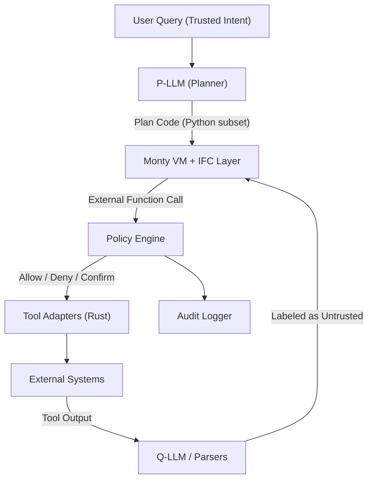
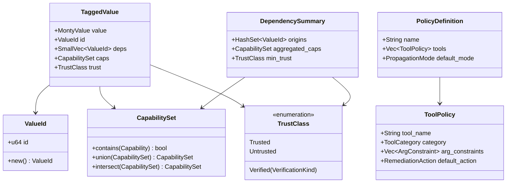

# Technical specification

## Agent action plan

### Product understanding

#### Core product vision

Based on the prompt, the Blitzy platform understands that the new product is
**Zamburak** — a Rust-based agent capability governance framework that extends
Pydantic's Monty interpreter with CaMeL-inspired information flow control (IFC)
and policy-core-style taint semantics to create a secure execution environment
for AI agents. The name "Zamburak" evokes a swivel gun mounted on a camel — a
fitting metaphor for precision-controlled capability mounted on the CaMeL
framework.

**Functional Requirements:**

- **Monty Interpreter Extension** — Fork and extend the Monty sandboxed Python
  interpreter (written in Rust) to attach provenance and capability metadata to
  every runtime value, enabling dynamic information flow tracking within agent
  plan code
- **Dependency Graph Engine** — Implement a directed acyclic graph (DAG) of
  value dependencies that tracks how data flows through operations (e.g.,
  `c = a + b` makes `c` depend on both `a` and `b`), with both NORMAL and
  STRICT propagation modes
- **STRICT Mode Control-Flow Tracking** — Implement control-dependency
  injection where `if`/loop conditions become dependencies of values assigned
  within their blocks, preventing side-channel leaks through conditional tool
  calls
- **Policy Engine at Tool Boundary** — Intercept all external function calls at
  the Monty ↔ host boundary, evaluating transitive dependency summaries against
  configurable security policies before allowing tool execution
- **Taint Semantics Pipeline** — Implement a
  `Tainted<T> → Sanitizer → Verified<T> → Sink` runtime discipline inspired by
  the archived `policy-core` crate, where only host-provided deterministic
  sanitizers can upgrade trust labels
- **Capability Taxonomy System** — Define and enforce fine-grained capability
  labels (e.g., `UNTRUSTED_TEXT`, `PRIVATE_CONTENT`, `PII_EMAIL`, `AUTH_TOKEN`)
  on values, restricting which capabilities may flow into which tool call sinks
- **Error Redaction Layer** — Implement exception text redaction for error
  messages that may contain untrusted data, preventing prompt injection through
  repair-loop feedback channels
- **Audit Trail Generator** — Produce structured, human-readable audit logs for
  every policy decision (allow/deny/confirm) with dependency chain explanations
- **Draft-vs-Commit Action Model** — Implement two-phase tool adapters where
  agents prepare draft actions (emails, calendar events, payments) that require
  explicit commit steps for irreversible operations

**Non-Functional Requirements:**

- **Performance** — Interpreter overhead with IFC tags must remain within
  acceptable bounds; target startup time comparable to Monty's sub-microsecond
  baseline
- **Memory Efficiency** — Dependency graph must use bounded memory growth even
  under adversarial workloads with deeply nested control flow or large value
  sets
- **Security Correctness** — The system must guarantee that untrusted data
  cannot steer control flow, forge Verified tokens, or bypass policy gates
  through taint laundering (concatenation, slicing, JSON encode/decode)
- **Crash Resistance** — No panics from adversarially crafted plan code;
  resource limits must be enforced on dependency graph expansion as well as
  execution
- **Extensibility** — Policy format (YAML/JSON/Rust builder) must be composable
  and declarative, allowing users to define new tool categories, trust levels,
  and remediation actions without modifying the interpreter core
- **Cross-Platform Interoperability** — Like Monty, Zamburak should be callable
  from Rust, Python, and JavaScript/TypeScript contexts

**Implicit Requirements Surfaced:**

- Snapshot/resume fidelity must preserve dependency graphs and trust labels
  across serialization boundaries
- The P-LLM (Planner LLM) prompt engineering layer must ensure only trusted
  user queries influence the plan skeleton
- Tool documentation injection must be treated as a potential attack surface
  and hardened accordingly
- A "Q-LLM" (Quarantined LLM) pattern for processing untrusted content must
  label all outputs as untrusted unless passed through deterministic
  verification

#### User instructions interpretation

**Critical Directives Captured:**

- **Starting Point**: Fork Pydantic's Monty
  (`https://github.com/pydantic/monty`) as the execution substrate; do not
  build a parser/execution engine from scratch
- **Inspiration Source**: Use the `policy-core` Rust crate's conceptual model
  (`Tainted<T>` → `Verified<T>` with capability-based sink gating) as a design
  reference, not a runtime dependency — the crate was archived on February 3,
  2026
- **Security Framework**: Implement CaMeL-style dependency tracking as
  described in the Google DeepMind paper "Defeating Prompt Injections by
  Design" (arXiv:2503.18813), with both NORMAL and STRICT modes
- **Threat Model**: Address Simon Willison's "lethal trifecta" — private data
  access + exposure to untrusted content + external communication capability —
  as the primary threat this system is designed to neutralize
- **Approval Philosophy**: The user explicitly states skepticism about naive
  approval models ("spammy pop-ups"), preferring instead that tool calls become
  structured "claims" with data lineage, making approvals rare, meaningful, and
  typed
- **Thin Slice Strategy**: Begin with a minimal proof-of-concept: fork Monty,
  attach `ValueId + deps + trust` to values, implement STRICT-mode dependency
  propagation for `if`/loops, implement one egress tool (`send_email`) + one
  untrusted source tool (`get_last_email`), one deterministic sanitizer (email
  address validator/allowlist), and demonstrate policy blocks

User Example (preserved verbatim):
> "I don't want to run molt-bot type systems on my personal data because of the
> 'lethal trifecta' identified by Simon Willison as being endemic in such
> systems."

User Example (preserved verbatim):
> "I want agentic systems to get to the point of being able to act as an 'AI
> chief of staff' without worrying about being simultaneously doxxed, carded,
> robbed, embarrassed and hax0red."

User Example (preserved verbatim):
> "Pydantic built Monty because they want Code Mode to be low friction and
> fast. I have similar thoughts about agent capability governance."

**Technology Stack Preferences:**

- Primary language: Rust (to extend Monty natively)
- Interpreter substrate: Monty (Rust-based restricted Python subset interpreter)
- Design pattern reference: `policy-core` crate (taint/capability semantics)
- Research foundation: CaMeL paper and reference implementation

**Architecture Patterns Implied:**

- "Monty-the-bytecode-engine under a CaMeL VM" — wrapping the interpreter with
  capability-tracking layer
- External functions as the sole portal to side effects (inherited from Monty's
  design)
- Dual LLM pattern: P-LLM (privileged planner) + Q-LLM (quarantined processor
  for untrusted content)
- Two-phase commit for irreversible actions

**Integration Requirements:**

- MCP (Model Context Protocol) servers as tool endpoints
- External tool adapters for email, calendar, web fetch, database systems
- Agent loop integration with planner prompt + code repair loop
- State persistence using Monty's snapshot/resume mechanism at external calls

#### Product type classification

- **Product Category**: Security Framework / Embedded Interpreter Extension
  (Rust Library with CLI tooling)
- **Target Users**:
  - AI agent framework developers building secure personal assistants
  - Security researchers investigating prompt injection defenses
  - Developers integrating LLM-driven automation with personal data (email,
    calendar, finance)
- **Use Cases**:
  - Secure inbox triage with draft reply generation
  - Calendar scheduling with draft event holds
  - Expense tracking with draft transaction proposals
  - Any agentic workflow where the "lethal trifecta" conditions exist
- **Scale Expectations**: Research-quality prototype progressing toward
  production hardening; the user acknowledges both Monty and CaMeL's reference
  implementation are "explicitly experimental research-y artefacts" and plans
  for "serious adversarial testing and unpleasant edge-case work"
- **Maintenance and Evolution**: Designed as a long-lived security framework
  requiring continuous adversarial testing, red-team harness integration, and
  policy evolution as new tool types and attack vectors emerge

### Background research

#### Technology research

Web search research conducted includes:

##### Monty interpreter (Pydantic)

Monty can be snapshotted to bytes at external function calls, meaning you can
store the interpreter state in a file or database and resume later. It has
startup extremely fast (&lt;1μs to go from code to execution result), and
runtime performance similar to CPython. Instead of making sequential tool
calls, the LLM writes Python code that calls your tools as functions and Monty
executes it safely. Pydantic is working on Monty to solve the use case
initially intended for mcp-run-python, with better security, lower latency,
easier install, and better ways to communicate with the OS. Pydantic's Monty
provides a custom Python-like language (a subset of Python) in Rust and makes
it available as both a Rust library and a Python package. It is small, fast,
widely available (thanks to Rust and WebAssembly) and provides strict limits on
memory usage, CPU time and access to disk and network.

The critical property for Zamburak is Monty's "no ambient authority" design —
filesystem, environment, and network access only exist via external functions
explicitly provided by the host. This maps directly onto CaMeL's requirement
that all effectful tools go through a policy gate.

##### CaMeL framework (Google DeepMind)

CaMeL is a robust defense that creates a protective system layer around the
LLM, securing it even when underlying models are susceptible to attacks. CaMeL
explicitly extracts the control and data flows from the (trusted) query;
therefore, the untrusted data retrieved by the LLM can never impact the program
flow. Rather than relying on more AI to defend AI systems, CaMeL applies
traditional software security principles such as control flow integrity, access
control, and information flow control. CaMeL associates, to every value, some
metadata (commonly called capabilities) to restrict data and control flows.
CaMeL demonstrates effectiveness by solving 77% of tasks with provable security
(compared to 84% with an undefended system) in AgentDojo.

The CaMeL reference implementation is a research artifact released to reproduce
paper results. The interpreter implementation likely contains bugs and might
not be fully secure. This is not a Google product and they are not planning to
maintain the codebase.

##### Simon Willison's lethal trifecta

The lethal trifecta of capabilities is: Access to your private data — one of
the most common purposes of tools in the first place! Exposure to untrusted
content — any mechanism by which text (or images) controlled by a malicious
attacker could become available to your LLM. The ability to externally
communicate in a way that could be used to steal your data. If your agent
combines these three features, an attacker can easily trick it into accessing
your private data and sending it to that attacker.

The problem with Model Context Protocol (MCP) is that it encourages users to
mix and match tools from different sources that can do different things.
Treating "exposure to untrusted content" as a taint event suggests a very
deterministic mitigation: taint tracking + policy gating. If the current state
is tainted, block (or require explicit human approval for) any action with
exfiltration potential.

##### Dromedary and Microsoft CaMeL replication

Dromedary implements a Code-Then-Execute Pattern to first generate Python code
given a user prompt, specifying what tools should be called. The generated code
is then executed by a custom Python interpreter which tracks information flow
and control flow and can enforce security policies. There are two important
tracking mechanisms: Data Provenance (where data comes from and goes to) and
Data Labels (how sensitive the data is). Dromedary's developers note the Python
interpreter needs to be performant and robust, and one idea is to use Rust to
write the interpreter.

#### Architecture pattern research

**Information Flow Control (IFC) Patterns for Rust:**

Research into Rust-based IFC approaches reveals several relevant patterns:

- The Rust programming language is an excellent candidate
  for taint analysis, as it has an ownership system which enforces strict
  aliasing rules, and should improve the precision of static taint analysis.
  Rust's ownership model provides a natural foundation for tracking value
  provenance at the language level.

- While aliasing is not an issue in safe Rust due to
  the ownership model preventing pointer aliasing issues, as soon as unsafe
  code blocks are involved, aliasing becomes an issue again. Zamburak must
  minimize `unsafe` usage and audit any `unsafe` blocks rigorously.

**CaMeL's Dependency Tracking Approach:**

The CaMeL paper describes a dependency graph model where every value carries
metadata about its origins and the policy engine traverses dependencies
transitively before tool calls. Two critical modes are defined:

- **NORMAL Mode**: Direct data dependencies only — `c = a + b` means `c`
  depends on `a` and `b`
- **STRICT Mode**: Control-flow conditions become dependencies of values
  assigned within their blocks, preventing side-channel exfiltration through
  conditional tool execution

**Reference Architectures from Similar Products:**

- **CaMeL Reference Implementation** (Python) — Custom restricted Python
  interpreter with dependency graph and policy enforcement at tool boundaries
- **Dromedary** (Microsoft, Python) — CaMeL replication with MCP server
  support, currently Python-only and explicitly marked "not for production"
- **Monty** (Pydantic, Rust) — Sandboxed Python subset interpreter with
  external function chokepoint — the ideal execution substrate

**Anti-Patterns to Avoid:**

- Relying on model-level defenses (prompt training, fine-tuning) for security —
  these are probabilistic and fail under adversarial pressure
- Showing raw exception text containing untrusted payloads in repair loops —
  this is a known injection tunnel
- Treating multi-agent decomposition as a security boundary — agents share
  memory and can propagate taint through "digital gossiping"
- Implementing naive approval UX that leads to confirmation fatigue and
  reflexive "yes" clicking

#### Dependency and tool research

**Latest Stable Versions of Proposed Technologies:**

Table 1: Latest stable versions of proposed technologies.

| Technology              | Version                | Purpose                            | Status                                                                                            |
| ----------------------- | ---------------------- | ---------------------------------- | ------------------------------------------------------------------------------------------------- |
| Rust (language)         | 1.93.0 (stable)        | Primary implementation language    | Stable: 1.93.0, Beta: 1.94.0                                                                      |
| Rust Edition            | 2024                   | Language edition                   | The 2024 Edition is now stable                                                                    |
| Monty                   | 0.0.3 (PyPI)           | Execution substrate (forked)       | Python bindings for the Monty sandboxed Python interpreter - 0.0.3                                |
| `untrusted_value` crate | Latest                 | Design reference for taint API     | Provides a type-safe way to handle and sanitize untrusted values with compile-time Taint checking |
| `policy-core` crate     | Archived (Feb 3, 2026) | Design reference (vendored/forked) | Archived — use as conceptual template only                                                        |
| CaMeL reference impl    | Research artifact      | Semantic reference                 | Research artifact released to reproduce paper results                                             |

**Development Tool Recommendations:**

Table 2: Recommended development tools and their purpose.

| Tool                       | Purpose                                          |
| -------------------------- | ------------------------------------------------ |
| `cargo-fuzz` / `libFuzzer` | Fuzz testing parser + bytecode + IFC layer       |
| `proptest` / `quickcheck`  | Property-based testing for dependency invariants |
| `cargo clippy`             | Lint enforcement in CI pipeline                  |
| `cargo-audit`              | Supply-chain vulnerability scanning              |
| `cargo-deny`               | License and advisory checking                    |
| CodeQL for Rust            | Static taint tracking on host code               |
| `miri`                     | Undefined behavior detection in unsafe blocks    |
| `criterion`                | Performance benchmarking of interpreter overhead |

**Testing Framework Standards:**

- Unit tests: Rust's built-in `#[test]` framework with `assert!` macros
- Property-based tests: `proptest` for generating random ASTs and verifying
  invariants
- Integration tests: Agent loop end-to-end tests with synthetic tool outputs
- Security tests: Adversarial "policy bypass" test suite with hostile tool
  outputs
- Benchmark tests: `criterion` for measuring IFC overhead on representative
  programs

**CI/CD Pipeline Patterns:**

- GitHub Actions with Rust toolchain caching
- Matrix builds across `stable`, `beta`, and `nightly` Rust channels
- Fuzz testing on nightly (required for `cargo-fuzz`)
- SARIF output for security findings integration
- Red-team harness in nightly CI for continuous adversarial testing

### Technical architecture design

#### Technology stack selection

- **Primary Language**: Rust 1.93.0 (Edition 2024) — Rationale: Monty is
  implemented in Rust; Zamburak extends it natively. Rust's ownership model
  provides memory safety guarantees critical for a security framework, and its
  type system enables compile-time enforcement of taint discipline in host code.

- **Execution Substrate**: Monty (forked from `pydantic/monty`) — Rationale:
  Monty provides sub-microsecond startup, resource limit enforcement (memory,
  allocations, stack depth, execution time), and snapshot/resume at external
  function calls. Its "no ambient authority" design where all side effects go
  through external functions creates the ideal chokepoint for policy
  enforcement.

- **Serialization**: `serde` + `serde_json` / `serde_yaml` — Rationale: Policy
  definitions in YAML/JSON require robust serialization; `serde` is the Rust
  ecosystem standard. Also needed for snapshot/resume with dependency graph
  persistence.

- **CLI Framework**: `clap` — Rationale: Industry standard for Rust CLI
  applications; provides derive macros for declarative argument parsing, useful
  for the `zamburak` CLI tool and policy validation commands.

- **Async Runtime**: `tokio` — Rationale: Monty supports async external
  function calls; `tokio` is the dominant async runtime in Rust and required
  for MCP server communication.

- **Testing**: `proptest` + `criterion` + `cargo-fuzz` — Rationale:
  Property-based testing is essential for validating dependency graph
  invariants; criterion provides statistical benchmarking; cargo-fuzz enables
  coverage-guided fuzzing of the interpreter.

- **Logging**: `tracing` — Rationale: Structured logging with span-based
  context is essential for audit trails; `tracing` integrates naturally with
  `tokio` and provides the granularity needed for per-tool-call policy decision
  logging.

#### Architecture pattern

**Overall Pattern**: Layered VM Architecture — Monty bytecode engine wrapped by
a CaMeL-inspired IFC layer with a policy engine at the external function
boundary.

**Justification**: The user's conversation explicitly frames this as
"Monty-the-bytecode-engine under a CaMeL VM." The layered approach separates
concerns: Monty handles parsing, bytecode compilation, and execution; the IFC
layer handles value tagging and dependency propagation; the policy engine
handles enforcement at tool boundaries. This separation allows each layer to be
tested, fuzzed, and hardened independently.

**Component Interaction Model:**



**Data Flow Architecture:**

_Figure 1: Component interaction model for the Zamburak execution pipeline._

The system enforces a strict separation between trusted and untrusted data
flows:

- **Trusted Flow**: User query → P-LLM → Plan code skeleton → Monty VM
  execution of control flow
- **Untrusted Flow**: Tool outputs → Q-LLM extraction → Values labeled with
  `TrustClass::Untrusted` → Only promotable via deterministic sanitizers
- **Policy Gate**: Every external function call triggers a transitive
  dependency summary check against the tool's declared policy before execution
  proceeds

**Security Architecture:**

The security model rests on four pillars:

- **Non-Forgeability**: Only host-provided sanitizer functions can mint
  `Verified(kind)` trust labels; Monty code cannot forge verification tokens
- **Dependency Completeness**: The IFC layer guarantees that the transitive
  closure of dependencies is always available for policy decisions
- **Control-Flow Integrity**: STRICT mode prevents untrusted values from
  influencing branching, looping, or tool selection through control-dependency
  injection
- **Redaction Safety**: Exception text flowing back into the planner loop is
  redacted to prevent untrusted content from becoming a prompt injection vector

#### Integration points

**MCP Server Integration:**

Zamburak's tool adapters communicate with external systems via the Model
Context Protocol (MCP). Each MCP server is wrapped in a Rust adapter that
declares its policy signature — required trust levels, forbidden capabilities,
and default remediation action.

**External Services to Integrate (Thin Slice):**

Table 3: Thin-slice service integration and policy examples.

| Service          | Tool Type        | Risk Class                      | Policy Example                                            |
| ---------------- | ---------------- | ------------------------------- | --------------------------------------------------------- |
| Email (read)     | Untrusted Source | Read-only / Untrusted ingestion | All outputs labeled `UNTRUSTED_TEXT`                      |
| Email (send)     | Egress Sink      | High-risk exfiltration          | Requires `Verified(EmailAddress)` for recipient           |
| Calendar (read)  | Data Source      | Mixed trust                     | Event data labeled by origin                              |
| Calendar (write) | State-Changing   | Medium-risk                     | Draft-only unless user confirms                           |
| Web fetch        | Untrusted Source | Read-only / Hostile             | All content labeled `UNTRUSTED_TEXT` + `EXTERNAL_CONTENT` |

**API Contracts:**

- Tool adapters expose a uniform `ExternalFunction` trait to Monty
- Each adapter declares a `PolicySignature` specifying per-argument trust
  requirements and capability restrictions
- Policy decisions return a structured `PolicyDecision` enum:
  `Allow(audit_entry)`, `Deny(reason, dependency_chain)`, or
  `RequireConfirmation(explanation, draft_action)`

**Authentication and Authorization:**

- Tool-level: Each MCP server connection authenticated via environment-scoped
  credentials
- Value-level: Capability labels act as value-level authorization — a value
  carrying `PII_EMAIL` cannot reach a generic HTTP egress tool without explicit
  allowlisting or user confirmation
- Host-level: The Zamburak runtime itself does not expose a network interface;
  it is an embedded library invoked by the agent loop

### Repository structure planning

#### Proposed repository structure

```plaintext
/
├── crates/                                # Workspace members (Rust crates)
│   ├── zamburak-core/                     # Core IFC engine and tagged value system
│   │   ├── src/
│   │   │   ├── lib.rs                     # Crate root, public API surface
│   │   │   ├── tagged_value.rs            # TaggedValue struct with ValueId, deps, trust, caps
│   │   │   ├── value_id.rs               # ValueId generation and management
│   │   │   ├── dependency_graph.rs        # DAG-based dependency tracking engine
│   │   │   ├── trust.rs                   # TrustClass enum (Trusted, Untrusted, Verified)
│   │   │   ├── capability.rs              # CapabilitySet definitions and operations
│   │   │   ├── propagation.rs             # Dependency propagation rules (NORMAL + STRICT)
│   │   │   ├── control_context.rs         # Control-flow dependency stack for STRICT mode
│   │   │   ├── summary.rs                 # Transitive closure computation with caching
│   │   │   └── errors.rs                  # Core error types
│   │   ├── Cargo.toml
│   │   └── README.md
│   │
│   ├── zamburak-interpreter/              # Extended Monty interpreter with IFC hooks
│   │   ├── src/
│   │   │   ├── lib.rs                     # Interpreter crate root
│   │   │   ├── vm.rs                      # Extended VM execution loop with tagging
│   │   │   ├── opcodes.rs                 # Opcode interception for dependency edges
│   │   │   ├── external_call.rs           # External function call boundary with policy check
│   │   │   ├── snapshot.rs                # Snapshot/resume with dependency graph persistence
│   │   │   ├── redaction.rs               # Exception text redaction for untrusted content
│   │   │   └── resource_limits.rs         # Extended resource limits for dependency graph
│   │   ├── Cargo.toml
│   │   └── README.md
│   │
│   ├── zamburak-policy/                   # Policy engine and enforcement
│   │   ├── src/
│   │   │   ├── lib.rs                     # Policy crate root
│   │   │   ├── engine.rs                  # Policy decision procedure
│   │   │   ├── policy_def.rs              # Policy definition types (YAML/JSON schema)
│   │   │   ├── tool_signature.rs          # PolicySignature for tool boundary declarations
│   │   │   ├── decision.rs                # PolicyDecision enum (Allow/Deny/RequireConfirmation)
│   │   │   ├── audit.rs                   # Structured audit log generation
│   │   │   └── defaults.rs                # Built-in default policies for common tool categories
│   │   ├── Cargo.toml
│   │   └── README.md
│   │
│   ├── zamburak-sanitizers/               # Deterministic sanitizers and verifiers
│   │   ├── src/
│   │   │   ├── lib.rs                     # Sanitizer crate root
│   │   │   ├── traits.rs                  # Sanitizer and Verifier trait definitions
│   │   │   ├── email.rs                   # Email address validation + allowlist
│   │   │   ├── url.rs                     # URL validation + scheme/allowlist restrictions
│   │   │   ├── numeric.rs                 # Numeric constraint validation (amount limits)
│   │   │   └── template.rs               # Safe templating with escaping
│   │   ├── Cargo.toml
│   │   └── README.md
│   │
│   ├── zamburak-tools/                    # Tool adapter implementations
│   │   ├── src/
│   │   │   ├── lib.rs                     # Tool adapter crate root
│   │   │   ├── traits.rs                  # ExternalFunction trait definition
│   │   │   ├── email_read.rs              # Email ingestion adapter (untrusted source)
│   │   │   ├── email_send.rs              # Email send adapter (egress sink)
│   │   │   ├── calendar_read.rs           # Calendar read adapter
│   │   │   ├── calendar_write.rs          # Calendar write adapter (draft/commit)
│   │   │   ├── web_fetch.rs               # HTTP fetch adapter (untrusted source)
│   │   │   └── mcp_bridge.rs              # Generic MCP server bridge
│   │   ├── Cargo.toml
│   │   └── README.md
│   │
│   ├── zamburak-agent/                    # Agent loop orchestration
│   │   ├── src/
│   │   │   ├── lib.rs                     # Agent crate root
│   │   │   ├── planner.rs                 # P-LLM prompt construction and plan generation
│   │   │   ├── repair_loop.rs             # Code repair loop with redacted error feedback
│   │   │   ├── confirmation.rs            # User confirmation interface
│   │   │   └── state.rs                   # Agent state management with Monty snapshots
│   │   ├── Cargo.toml
│   │   └── README.md
│   │
│   └── zamburak-cli/                      # CLI binary for running and testing Zamburak
│       ├── src/
│       │   ├── main.rs                    # CLI entry point
│       │   ├── commands/
│       │   │   ├── mod.rs                 # Command module root
│       │   │   ├── run.rs                 # Execute plan code with IFC enforcement
│       │   │   ├── validate.rs            # Validate policy files
│       │   │   ├── audit.rs               # View and query audit logs
│       │   │   └── test_policy.rs         # Run policy test vectors
│       │   └── config.rs                  # CLI configuration loading
│       ├── Cargo.toml
│       └── README.md
│
├── policies/                              # Policy definition files
│   ├── default.yaml                       # Default policy set for common tools
│   ├── strict.yaml                        # Maximum-security policy preset
│   ├── examples/
│   │   ├── email_triage.yaml              # Policy for email triage use case
│   │   └── calendar_scheduling.yaml       # Policy for calendar scheduling use case
│   └── schema.json                        # JSON Schema for policy validation
│
├── tests/                                 # Integration and security test suites
│   ├── integration/
│   │   ├── test_dependency_propagation.rs # End-to-end dependency tracking tests
│   │   ├── test_policy_enforcement.rs     # Policy decision integration tests
│   │   ├── test_snapshot_resume.rs        # Snapshot/resume fidelity tests
│   │   └── test_agent_loop.rs             # Full agent loop integration tests
│   ├── security/
│   │   ├── test_strict_mode_bypass.rs     # STRICT mode side-channel regression tests
│   │   ├── test_taint_laundering.rs       # Taint propagation through string ops
│   │   ├── test_exception_injection.rs    # Exception text injection vector tests
│   │   ├── test_control_flow_leak.rs      # Control-flow-based exfiltration attempts
│   │   └── adversarial_corpus/            # Hostile tool output test vectors
│   │       ├── obvious_injection.txt
│   │       ├── system_prompt_impersonation.txt
│   │       ├── multi_step_attack.txt
│   │       └── data_poisoning.json
│   ├── property/
│   │   ├── test_monotonicity.rs           # Dependency monotonicity invariant
│   │   ├── test_no_spontaneous_verify.rs  # Trust never upgrades without sanitizer
│   │   └── test_closure_correctness.rs    # Transitive closure consistency
│   ├── compatibility/
│   │   └── test_monty_compat.rs           # Differential tests against upstream Monty
│   └── benchmarks/
│       ├── bench_ifc_overhead.rs          # IFC tagging overhead measurement
│       ├── bench_policy_check.rs          # Policy decision latency benchmarks
│       └── bench_dependency_closure.rs    # Transitive closure computation benchmarks
│
├── fuzz/                                  # Fuzz testing targets
│   ├── fuzz_targets/
│   │   ├── fuzz_parser.rs                 # Fuzz the Monty parser with tagged values
│   │   ├── fuzz_bytecode.rs               # Fuzz bytecode execution with IFC
│   │   └── fuzz_policy.rs                 # Fuzz policy evaluation with synthetic graphs
│   └── Cargo.toml
│
├── docs/                                  # Documentation
│   ├── architecture/
│   │   ├── overview.md                    # High-level architecture overview
│   │   ├── threat_model.md                # Threat model and attacker assumptions
│   │   ├── ifc_semantics.md               # IFC dependency tracking semantics
│   │   └── policy_format.md               # Policy definition language specification
│   ├── guides/
│   │   ├── getting_started.md             # Quick start guide
│   │   ├── writing_policies.md            # How to write and test policies
│   │   ├── writing_sanitizers.md          # How to implement custom sanitizers
│   │   └── writing_tool_adapters.md       # How to create new tool adapters
│   └── security/
│       ├── security_semantics_spec.md     # Formal-ish security semantics specification
│       └── evaluation_suite.md            # Evaluation suite documentation
│
├── scripts/                               # Utility scripts
│   ├── setup.sh                           # Development environment setup
│   ├── run_security_tests.sh              # Run full security test suite
│   └── run_benchmarks.sh                  # Run performance benchmarks
│
├── .github/                               # GitHub configuration
│   └── workflows/
│       ├── ci.yml                         # Main CI pipeline (build, test, lint, clippy)
│       ├── security.yml                   # Security-focused CI (fuzz, adversarial tests)
│       └── bench.yml                      # Performance benchmark tracking
│
├── Cargo.toml                             # Workspace root Cargo.toml
├── Cargo.lock                             # Dependency lockfile
├── rust-toolchain.toml                    # Rust toolchain pinning
├── .gitignore                             # Git ignore rules
├── .env.example                           # Environment variables template (API keys, etc.)
├── LICENSE                                # MIT License (matching Monty)
└── README.md                              # Project documentation and overview
```

#### File path specifications

**Core Application Files:**

- `crates/zamburak-core/src/tagged_value.rs` — Define the `TaggedValue` struct
  containing `MontyValue`, `ValueId`, dependency edges
  (`SmallVec<[ValueId; 4]>`), `CapabilitySet`, and `TrustClass`
- `crates/zamburak-core/src/dependency_graph.rs` — Implement the DAG-based
  dependency tracking engine with insertion, query, and bounded transitive
  closure computation
- `crates/zamburak-core/src/propagation.rs` — Implement NORMAL and STRICT mode
  propagation rules for arithmetic, indexing, attribute access, comparisons,
  and function calls
- `crates/zamburak-core/src/control_context.rs` — Implement the
  control-dependency stack: push condition `ValueId` on `if`/loop entry, inject
  as dependencies in STRICT mode assignments, pop on block exit
- `crates/zamburak-interpreter/src/vm.rs` — Extend Monty's VM execution loop to
  intercept opcodes and attach dependency edges to resulting values
- `crates/zamburak-interpreter/src/external_call.rs` — Implement the policy
  gate at the external function boundary: gather transitive dependency summary,
  evaluate policy, return structured decision
- `crates/zamburak-policy/src/engine.rs` — Implement the policy decision
  procedure that evaluates tool arguments' dependency summaries against
  declared policy signatures

**Configuration Files:**

- `Cargo.toml` (root) — Workspace definition with all crate members
- `rust-toolchain.toml` — Pin Rust toolchain to `1.93.0` (stable)
- `policies/default.yaml` — Default policy set defining tool categories, trust
  requirements, and remediation defaults
- `policies/schema.json` — JSON Schema for validating policy file structure
- `.env.example` — Document required environment variables (LLM API keys, MCP
  server configs)

**Entry Points:**

- `crates/zamburak-cli/src/main.rs` — CLI application entry point for running
  plans, validating policies, and querying audit logs
- `crates/zamburak-agent/src/lib.rs` — Library entry point for embedding
  Zamburak in agent frameworks
- `crates/zamburak-core/src/lib.rs` — Core library entry point exposing
  `TaggedValue`, `DependencyGraph`, `CapabilitySet`, and `TrustClass`

### Implementation specifications

#### Core components or modules to implement

**Component A: Tagged Value System** (`zamburak-core`)

- **Purpose**: Attach unforgeable provenance/capability metadata to every
  runtime value inside the Monty interpreter, forming the foundation of the IFC
  layer
- **Location**: `crates/zamburak-core/src/tagged_value.rs`, `value_id.rs`,
  `trust.rs`, `capability.rs`
- **Key Interfaces**:
  - `TaggedValue` — Wraps `MontyValue` with `ValueId`, dependency edges,
    `CapabilitySet`, and `TrustClass`
  - `ValueId` — Unique, monotonically increasing identifier for each value
    instance
  - `TrustClass` — Enum: `Trusted`, `Untrusted`, `Verified(VerificationKind)`
  - `CapabilitySet` — Bitflag or `EnumSet` representing labels like
    `PII_EMAIL`, `AUTH_TOKEN`, `PRIVATE_CONTENT`

**Component B: Dependency Graph Engine** (`zamburak-core`)

- **Purpose**: Maintain a directed acyclic graph of value-to-value dependencies
  and compute transitive closures on demand for policy decisions
- **Location**: `crates/zamburak-core/src/dependency_graph.rs`, `summary.rs`
- **Key Interfaces**:
  - `DependencyGraph` — Insert edges, query direct parents, compute bounded
    transitive closure
  - `DependencySummary` — Cached result of transitive closure: aggregated
    origins, capabilities, trust levels
  - `summarize(value_id) -> DependencySummary` — Bounded DFS/BFS with LRU
    caching
- **Dependencies**: `zamburak-core::tagged_value`, `zamburak-core::capability`

**Component C: Propagation Engine** (`zamburak-core`)

- **Purpose**: Define and enforce rules for how dependencies propagate through
  operations (arithmetic, indexing, attribute access) and control-flow
  constructs (if/else, loops)
- **Location**: `crates/zamburak-core/src/propagation.rs`, `control_context.rs`
- **Key Interfaces**:
  - `PropagationMode` — Enum: `Normal`, `Strict`
  - `ControlContextStack` — Push/pop control-flow condition `ValueId`s; inject
    as dependencies in STRICT mode
  - `propagate_binary_op(left, right) -> DependencyEdges` — Compute output
    dependencies for binary operations
  - `propagate_assignment(target, source, control_ctx) -> DependencyEdges` —
    Handle STRICT mode injection

**Component D: Policy Engine** (`zamburak-policy`)

- **Purpose**: Evaluate transitive dependency summaries against declared tool
  policies at every external function call boundary
- **Location**: `crates/zamburak-policy/src/engine.rs`, `policy_def.rs`,
  `decision.rs`, `tool_signature.rs`
- **Key Interfaces**:
  - `PolicyEngine::check(tool, args_summary, context) -> PolicyDecision` — Core
    decision procedure
  - `PolicyDefinition` — Deserialized from YAML/JSON; specifies tool
    categories, argument trust requirements, forbidden capabilities
  - `PolicyDecision` — Enum: `Allow(AuditEntry)`,
    `Deny(Reason, DependencyChain)`,
    `RequireConfirmation(Explanation, DraftAction)`
  - `ToolSignature` — Per-tool declaration of required trust levels and
    capability restrictions
- **Dependencies**: `zamburak-core::summary`, `zamburak-core::capability`

**Component E: Extended Interpreter** (`zamburak-interpreter`)

- **Purpose**: Intercept Monty's opcode execution to attach dependency edges,
  enforce control-flow tracking, and gate external function calls through the
  policy engine
- **Location**: `crates/zamburak-interpreter/src/vm.rs`, `opcodes.rs`,
  `external_call.rs`, `redaction.rs`
- **Key Interfaces**:
  - `ZamburakVM` — Wraps Monty's VM with IFC-aware execution loop
  - `execute_with_ifc(code, external_fns, policy) -> ExecutionResult` —
    Top-level execution entry point
  - `redact_exception(error, dependency_graph) -> RedactedError` — Strip
    untrusted content from error messages
- **Dependencies**: `monty` (forked), `zamburak-core`, `zamburak-policy`

**Component F: Sanitizer Framework** (`zamburak-sanitizers`)

- **Purpose**: Provide deterministic validators that are the sole mechanism for
  upgrading `Untrusted` values to `Verified(kind)` — the "mint" for trust tokens
- **Location**: `crates/zamburak-sanitizers/src/traits.rs`, `email.rs`,
  `url.rs`, `numeric.rs`
- **Key Interfaces**:
  - `Sanitizer<T>` trait —
    `fn sanitize(input: TaggedValue) -> Result<TaggedValue, PolicyViolation>`
  - `EmailAddressSanitizer` — Validates and allowlists email addresses,
    producing `Verified(EmailAddress)`
  - `UrlSanitizer` — Validates URL scheme + domain allowlist, producing
    `Verified(AllowlistedUrl)`
- **Dependencies**: `zamburak-core::tagged_value`, `zamburak-core::trust`

#### Data models and schemas

**Core Entity Definitions:**



**Relationship Mappings:**

- `TaggedValue` → `DependencyGraph`: Each value's `deps` field points to parent
  `ValueId`s in the graph
- `DependencyGraph` → `DependencySummary`: Transitive closure queries produce
  cached summaries
- `ToolPolicy` → `CapabilitySet`: Each tool declares which capabilities it
  requires and which are forbidden
- `Sanitizer` → `TrustClass`: Sanitizers produce values with upgraded
  `TrustClass::Verified(kind)`

**Validation Rules and Constraints:**

- `ValueId` must be unique and monotonically increasing within an execution
  context
- Dependencies must form a DAG — cycles indicate a bug in the propagation engine
- `TrustClass::Verified(kind)` can only be produced by a registered
  `Sanitizer` — the interpreter must reject any path that produces Verified
  without calling a sanitizer
- `CapabilitySet` union is monotonic through propagation — capabilities only
  accumulate, never shrink (except through explicit sanitizer reduction)
- Policy definitions must pass JSON Schema validation before loading

**Policy Definition Schema (YAML):**

```yaml
name: "email_triage"
default_mode: strict
tools:
  - name: "get_last_email"
    category: untrusted_source
    output_labels: [UNTRUSTED_TEXT, EXTERNAL_CONTENT]
  - name: "send_email"
    category: egress_sink
    args:
      - name: "to"
        required_trust: Verified(EmailAddress)
      - name: "body"
        forbidden_caps: [AUTH_TOKEN, PII_SSN]
    default_action: require_confirmation
```

#### API specifications

**Zamburak Core Library API:**

The primary programmatic interface is the `zamburak-core` crate, consumed by
`zamburak-interpreter` and by external agent frameworks embedding Zamburak.

**Key Public Functions:**

Table 4: Key public functions in the core library API.

| Function                     | Signature                                                           | Purpose                                        |
| ---------------------------- | ------------------------------------------------------------------- | ---------------------------------------------- |
| `TaggedValue::new`           | `(value: MontyValue, trust: TrustClass) -> TaggedValue`             | Create a new tagged value with a fresh ValueId |
| `DependencyGraph::add_edge`  | `(&mut self, from: ValueId, to: ValueId)`                           | Record a dependency edge                       |
| `DependencyGraph::summarize` | `(&self, id: ValueId) -> DependencySummary`                         | Compute transitive closure with caching        |
| `PolicyEngine::check`        | `(&self, tool: &str, args: &[DependencySummary]) -> PolicyDecision` | Evaluate policy for a tool call                |
| `ZamburakVM::execute`        | `(code: &str, fns: ExternalFnSet, policy: PolicyDef) -> ExecResult` | Execute plan code with full IFC                |
| `Sanitizer::sanitize`        | `(input: TaggedValue) -> Result<TaggedValue, PolicyViolation>`      | Verify and upgrade trust label                 |

**CLI Interface:**

Table 5: CLI interface commands.

| Command                | Arguments                                    | Purpose                                |
| ---------------------- | -------------------------------------------- | -------------------------------------- |
| `zamburak run`         | `<plan_file> --policy <policy.yaml>`         | Execute plan code with IFC enforcement |
| `zamburak validate`    | `<policy.yaml>`                              | Validate policy file against schema    |
| `zamburak audit`       | `<audit_log> [--filter tool=...]`            | Query and display audit trail          |
| `zamburak test-policy` | `<test_vectors.yaml> --policy <policy.yaml>` | Run policy enforcement test vectors    |

**Policy Decision Response Schema:**

Each policy check returns a structured decision that is both machine-parseable
and human-readable:

- `Allow` — Tool call proceeds; audit entry logged with dependency summary
- `Deny` — Tool call blocked; reason includes the specific dependency chain
  that violated policy and the violated constraint
- `RequireConfirmation` — Tool call suspended; explanation includes
  natural-language description of the action, data lineage, and risk assessment
  for user review

### Scope definition

#### Explicitly in scope

**Core IFC Engine (Foundation):**

- `TaggedValue` struct with `ValueId`, dependency edges, `CapabilitySet`, and
  `TrustClass`
- `DependencyGraph` with insertion, querying, and bounded transitive closure
  computation with LRU caching
- NORMAL mode dependency propagation through arithmetic, string operations,
  indexing, attribute access, and function calls
- STRICT mode control-flow dependency injection for `if`/`else` blocks and
  `for`/`while` loops
- `ControlContextStack` for managing control-flow dependency scopes
- Dependency monotonicity invariant: dependencies only grow, never shrink
  (except through explicit sanitizer)
- Non-forgeability guarantee: trust can only be upgraded by host-provided
  sanitizers

**Extended Monty Interpreter:**

- Opcode interception hooks for attaching dependency edges to resulting values
  during execution
- External function call boundary with policy engine integration
- Exception text redaction to prevent untrusted content from flowing into
  planner repair loops
- Snapshot/resume fidelity including dependency graph and trust labels
- Extended resource limits covering dependency graph memory and node count

**Policy Engine:**

- Policy definition format in YAML with JSON Schema validation
- Per-tool `PolicySignature` declarations (required trust, forbidden
  capabilities, remediation action)
- Policy decision procedure:
  `check(tool, args_summary, context) -> PolicyDecision`
- Structured audit log generation with per-decision dependency chain
  explanations
- Default policy presets (default, strict) and example policies for email
  triage and calendar scheduling

**Sanitizer Framework:**

- `Sanitizer<T>` trait definition with the sole mechanism for upgrading
  `TrustClass`
- Email address sanitizer with allowlist support (`Verified(EmailAddress)`)
- URL sanitizer with scheme restriction and domain allowlist
  (`Verified(AllowlistedUrl)`)
- Numeric constraint sanitizer for amount validation

**Tool Adapters (Thin Slice):**

- Email read adapter (untrusted source, all outputs labeled `UNTRUSTED_TEXT`)
- Email send adapter (egress sink, requires `Verified(EmailAddress)` for
  recipient)
- Generic `ExternalFunction` trait for uniform tool adapter interface
- Two-phase draft/commit pattern for irreversible actions

**Agent Loop Integration:**

- P-LLM prompt construction ensuring only trusted query influences plan skeleton
- Code repair loop with redacted error feedback
- User confirmation interface for `RequireConfirmation` policy decisions
- State persistence using Monty snapshot/resume

**CLI Tooling:**

- `zamburak run` — Execute plan code with IFC enforcement
- `zamburak validate` — Validate policy files against schema
- `zamburak audit` — Query and display audit trails
- `zamburak test-policy` — Run policy test vectors against a policy file

**Testing and Verification:**

- Property-based tests for dependency graph invariants (monotonicity,
  no-spontaneous-verify, closure correctness)
- STRICT mode side-channel regression test suite based on CaMeL paper attack
  patterns
- Taint laundering tests (string formatting, concatenation, slicing, JSON
  encode/decode)
- Differential compatibility tests against upstream Monty (functional behavior
  unchanged by IFC layer)
- Fuzz targets for parser, bytecode execution, and policy evaluation
- Performance benchmarks for IFC overhead, policy check latency, and transitive
  closure computation

**Infrastructure:**

- Rust workspace with separate crates for core, interpreter, policy,
  sanitizers, tools, agent, and CLI
- GitHub Actions CI pipeline with build, test, lint, clippy, and security
  workflows
- `rust-toolchain.toml` pinning to Rust 1.93.0 stable
- Documentation covering architecture, threat model, IFC semantics, policy
  format, and developer guides

#### Explicitly out of scope

**Advanced Tool Adapters Beyond Thin Slice:**

- Calendar read/write adapters (deferred to future iteration)
- Web fetch adapter (deferred to future iteration)
- Payment/financial tool adapters
- File system access tool adapters
- Generic MCP server bridge (stub only in initial version)

**Production Deployment Automation:**

- Container orchestration (Kubernetes, Docker Compose for production)
- Cloud provider deployment scripts (AWS, GCP, Azure)
- Production-grade monitoring, alerting, and dashboarding
- Production TLS/mTLS configuration for MCP connections
- Secrets management integration (Vault, AWS Secrets Manager)

**Advanced Security Features:**

- Formal verification of IFC semantics (though a prose security semantics spec
  is in scope)
- Automated attack generation red-team harness (manual adversarial corpus is in
  scope)
- AgentDojo benchmark integration for comparative evaluation
- Multi-agent coordination security (single-agent execution only)
- Cryptographic signing of tool documentation to prove provenance

**LLM Integration:**

- Specific LLM provider integrations (OpenAI, Anthropic, Google) — the agent
  loop will use a generic LLM interface
- P-LLM fine-tuning or training for Monty-compatible code generation
- Q-LLM implementation for untrusted content extraction (interface defined,
  implementation deferred)

**User Interface:**

- Web-based dashboard for policy management
- Graphical visualization of dependency graphs
- Mobile approval interface
- Rich notification system for confirmation requests

**Internationalization and Localization:**

- Multi-language policy definitions
- Localized audit log messages
- Non-English documentation

**Features Explicitly Excluded by Product Domain:**

- The system is an embedded library and CLI, not a standalone service — no HTTP
  API server
- No database is required for the core engine; audit logs are file-based
- No user authentication system — Zamburak assumes a single-user context
- No multi-tenancy support

### Deliverable mapping

#### File creation plan

Table 6: Planned files and their roles.

| File Path                                            | Purpose                                           | Content Type  | Priority |
| ---------------------------------------------------- | ------------------------------------------------- | ------------- | -------- |
| `Cargo.toml` (root)                                  | Workspace definition with all crate members       | Config        | High     |
| `rust-toolchain.toml`                                | Pin Rust toolchain to 1.93.0 stable               | Config        | High     |
| `crates/zamburak-core/src/lib.rs`                    | Core crate root; re-export public API             | Source        | High     |
| `crates/zamburak-core/src/tagged_value.rs`           | `TaggedValue` struct definition                   | Source        | High     |
| `crates/zamburak-core/src/value_id.rs`               | `ValueId` generation and management               | Source        | High     |
| `crates/zamburak-core/src/dependency_graph.rs`       | DAG dependency tracking engine                    | Source        | High     |
| `crates/zamburak-core/src/trust.rs`                  | `TrustClass` enum definition                      | Source        | High     |
| `crates/zamburak-core/src/capability.rs`             | `CapabilitySet` definitions and operations        | Source        | High     |
| `crates/zamburak-core/src/propagation.rs`            | NORMAL + STRICT mode propagation rules            | Source        | High     |
| `crates/zamburak-core/src/control_context.rs`        | Control-flow dependency stack                     | Source        | High     |
| `crates/zamburak-core/src/summary.rs`                | Transitive closure computation with caching       | Source        | High     |
| `crates/zamburak-core/src/errors.rs`                 | Core error types                                  | Source        | High     |
| `crates/zamburak-core/Cargo.toml`                    | Core crate dependencies and metadata              | Config        | High     |
| `crates/zamburak-interpreter/src/lib.rs`             | Interpreter crate root                            | Source        | High     |
| `crates/zamburak-interpreter/src/vm.rs`              | Extended VM execution loop with IFC hooks         | Source        | High     |
| `crates/zamburak-interpreter/src/opcodes.rs`         | Opcode interception for dependency edges          | Source        | High     |
| `crates/zamburak-interpreter/src/external_call.rs`   | External function call boundary with policy gate  | Source        | High     |
| `crates/zamburak-interpreter/src/snapshot.rs`        | Snapshot/resume with dependency graph persistence | Source        | High     |
| `crates/zamburak-interpreter/src/redaction.rs`       | Exception text redaction                          | Source        | High     |
| `crates/zamburak-interpreter/src/resource_limits.rs` | Extended resource limits for dependency graph     | Source        | Medium   |
| `crates/zamburak-interpreter/Cargo.toml`             | Interpreter crate dependencies                    | Config        | High     |
| `crates/zamburak-policy/src/lib.rs`                  | Policy crate root                                 | Source        | High     |
| `crates/zamburak-policy/src/engine.rs`               | Policy decision procedure                         | Source        | High     |
| `crates/zamburak-policy/src/policy_def.rs`           | Policy definition types (YAML/JSON)               | Source        | High     |
| `crates/zamburak-policy/src/tool_signature.rs`       | Per-tool policy signature declarations            | Source        | High     |
| `crates/zamburak-policy/src/decision.rs`             | `PolicyDecision` enum                             | Source        | High     |
| `crates/zamburak-policy/src/audit.rs`                | Structured audit log generation                   | Source        | Medium   |
| `crates/zamburak-policy/src/defaults.rs`             | Built-in default policies                         | Source        | Medium   |
| `crates/zamburak-policy/Cargo.toml`                  | Policy crate dependencies                         | Config        | High     |
| `crates/zamburak-sanitizers/src/lib.rs`              | Sanitizer crate root                              | Source        | High     |
| `crates/zamburak-sanitizers/src/traits.rs`           | `Sanitizer` and `Verifier` trait definitions      | Source        | High     |
| `crates/zamburak-sanitizers/src/email.rs`            | Email address validation + allowlist sanitizer    | Source        | High     |
| `crates/zamburak-sanitizers/src/url.rs`              | URL validation + scheme/allowlist sanitizer       | Source        | Medium   |
| `crates/zamburak-sanitizers/src/numeric.rs`          | Numeric constraint validation                     | Source        | Medium   |
| `crates/zamburak-sanitizers/src/template.rs`         | Safe templating with escaping                     | Source        | Low      |
| `crates/zamburak-sanitizers/Cargo.toml`              | Sanitizers crate dependencies                     | Config        | High     |
| `crates/zamburak-tools/src/lib.rs`                   | Tool adapter crate root                           | Source        | High     |
| `crates/zamburak-tools/src/traits.rs`                | `ExternalFunction` trait definition               | Source        | High     |
| `crates/zamburak-tools/src/email_read.rs`            | Email ingestion adapter (untrusted source)        | Source        | High     |
| `crates/zamburak-tools/src/email_send.rs`            | Email send adapter (egress sink)                  | Source        | High     |
| `crates/zamburak-tools/src/mcp_bridge.rs`            | Generic MCP server bridge (stub)                  | Source        | Medium   |
| `crates/zamburak-tools/Cargo.toml`                   | Tools crate dependencies                          | Config        | High     |
| `crates/zamburak-agent/src/lib.rs`                   | Agent crate root                                  | Source        | Medium   |
| `crates/zamburak-agent/src/planner.rs`               | P-LLM prompt construction                         | Source        | Medium   |
| `crates/zamburak-agent/src/repair_loop.rs`           | Code repair loop with redaction                   | Source        | Medium   |
| `crates/zamburak-agent/src/confirmation.rs`          | User confirmation interface                       | Source        | Medium   |
| `crates/zamburak-agent/src/state.rs`                 | Agent state management                            | Source        | Medium   |
| `crates/zamburak-agent/Cargo.toml`                   | Agent crate dependencies                          | Config        | Medium   |
| `crates/zamburak-cli/src/main.rs`                    | CLI binary entry point                            | Source        | Medium   |
| `crates/zamburak-cli/src/commands/mod.rs`            | Command module root                               | Source        | Medium   |
| `crates/zamburak-cli/src/commands/run.rs`            | Execute plan code command                         | Source        | Medium   |
| `crates/zamburak-cli/src/commands/validate.rs`       | Validate policy files command                     | Source        | Medium   |
| `crates/zamburak-cli/src/commands/audit.rs`          | Audit log query command                           | Source        | Low      |
| `crates/zamburak-cli/src/commands/test_policy.rs`    | Policy test vector runner                         | Source        | Medium   |
| `crates/zamburak-cli/Cargo.toml`                     | CLI crate dependencies                            | Config        | Medium   |
| `policies/default.yaml`                              | Default policy preset                             | Config        | High     |
| `policies/strict.yaml`                               | Maximum-security policy preset                    | Config        | Medium   |
| `policies/schema.json`                               | JSON Schema for policy validation                 | Config        | High     |
| `policies/examples/email_triage.yaml`                | Email triage policy example                       | Config        | Medium   |
| `tests/security/test_strict_mode_bypass.rs`          | STRICT mode side-channel regression suite         | Test          | High     |
| `tests/security/test_taint_laundering.rs`            | Taint propagation through string ops              | Test          | High     |
| `tests/security/test_exception_injection.rs`         | Exception text injection vectors                  | Test          | High     |
| `tests/security/test_control_flow_leak.rs`           | Control-flow exfiltration attempts                | Test          | High     |
| `tests/property/test_monotonicity.rs`                | Dependency monotonicity invariant                 | Test          | High     |
| `tests/property/test_no_spontaneous_verify.rs`       | No trust upgrade without sanitizer                | Test          | High     |
| `tests/property/test_closure_correctness.rs`         | Transitive closure consistency                    | Test          | High     |
| `tests/compatibility/test_monty_compat.rs`           | Differential tests vs upstream Monty              | Test          | High     |
| `tests/integration/test_dependency_propagation.rs`   | End-to-end dependency tracking                    | Test          | Medium   |
| `tests/integration/test_policy_enforcement.rs`       | Policy decision integration tests                 | Test          | Medium   |
| `tests/integration/test_snapshot_resume.rs`          | Snapshot/resume fidelity                          | Test          | Medium   |
| `tests/benchmarks/bench_ifc_overhead.rs`             | IFC tagging overhead measurement                  | Test          | Medium   |
| `fuzz/fuzz_targets/fuzz_parser.rs`                   | Fuzz Monty parser with tagged values              | Test          | Medium   |
| `fuzz/fuzz_targets/fuzz_bytecode.rs`                 | Fuzz bytecode execution with IFC                  | Test          | Medium   |
| `docs/architecture/overview.md`                      | High-level architecture overview                  | Documentation | Medium   |
| `docs/architecture/threat_model.md`                  | Threat model and attacker assumptions             | Documentation | High     |
| `docs/architecture/ifc_semantics.md`                 | IFC dependency tracking semantics spec            | Documentation | High     |
| `docs/architecture/policy_format.md`                 | Policy definition language specification          | Documentation | Medium   |
| `docs/security/security_semantics_spec.md`           | Formal-ish security semantics specification       | Documentation | High     |
| `.github/workflows/ci.yml`                           | Main CI pipeline                                  | Config        | Medium   |
| `.github/workflows/security.yml`                     | Security-focused CI workflow                      | Config        | Medium   |
| `.env.example`                                       | Environment variables template                    | Config        | Medium   |
| `README.md`                                          | Project overview and getting started              | Documentation | High     |
| `LICENSE`                                            | MIT License                                       | Documentation | High     |
| `.gitignore`                                         | Git ignore rules                                  | Config        | High     |

#### Implementation phases

**Phase 1: Foundation** — Core structure, configuration, and workspace setup

- Rust workspace with all seven crate skeletons (`Cargo.toml` files, `lib.rs`
  stubs)
- `rust-toolchain.toml`, `.gitignore`, `LICENSE`, `README.md`
- Monty fork integration as a workspace dependency
- `TaggedValue`, `ValueId`, `TrustClass`, `CapabilitySet` type definitions
- Core error types

**Phase 2: Core IFC Logic** — Dependency graph, propagation engine, and
control-flow tracking

- `DependencyGraph` implementation with insertion, querying, and bounded
  transitive closure
- NORMAL mode propagation rules for all operation types
- STRICT mode control-flow dependency injection with `ControlContextStack`
- `DependencySummary` computation with LRU caching
- Property-based tests for monotonicity, non-forgeability, and closure
  correctness

**Phase 3: Interpreter Integration** — Extended Monty VM with IFC hooks

- Opcode interception in the Monty execution loop to attach dependency edges
- External function call boundary with policy engine integration
- Exception text redaction layer
- Snapshot/resume with dependency graph and trust label persistence
- Extended resource limits for dependency graph memory
- Differential compatibility tests against upstream Monty

**Phase 4: Policy and Sanitizers** — Policy engine, sanitizer framework, and
tool adapters

- Policy definition format (YAML/JSON) with JSON Schema validation
- Policy decision procedure with structured audit logging
- `Sanitizer<T>` trait and email address sanitizer implementation
- `ExternalFunction` trait and email read/send adapter implementations
- Default and strict policy presets

**Phase 5: Agent Loop and CLI** — Agent integration and command-line interface

- P-LLM prompt construction and code repair loop
- User confirmation interface for `RequireConfirmation` decisions
- State persistence using Monty snapshots
- CLI commands: `run`, `validate`, `audit`, `test-policy`
- Example policies for email triage use case

**Phase 6: Security Testing and Documentation** — Comprehensive security
verification

- STRICT mode side-channel regression test suite
- Taint laundering and exception injection test suites
- Adversarial corpus with hostile tool output vectors
- Fuzz targets for parser, bytecode, and policy evaluation
- Performance benchmarks for IFC overhead
- Architecture, threat model, IFC semantics, and policy format documentation
- Security semantics specification
- GitHub Actions CI/CD pipelines

### References

#### External resources and URLs

Table 7: External resources and URLs.

| Resource                              | URL                                                                                    | Description                                                                                                                                                                         |
| ------------------------------------- | -------------------------------------------------------------------------------------- | ----------------------------------------------------------------------------------------------------------------------------------------------------------------------------------- |
| Monty (Pydantic)                      | `https://github.com/pydantic/monty`                                                    | A minimal, secure Python interpreter written in Rust for use by AI; the execution substrate that Zamburak forks and extends                                                         |
| CaMeL Paper                           | `https://arxiv.org/abs/2503.18813`                                                     | Google DeepMind paper proposing CaMeL, a robust defense that creates a protective system layer around the LLM; the primary research foundation for Zamburak's IFC design            |
| CaMeL Reference Implementation        | `https://github.com/google-research/camel-prompt-injection`                            | Research artifact released to reproduce paper results; the interpreter implementation likely contains bugs; used as semantic reference only                                         |
| Simon Willison — Lethal Trifecta      | `https://simonwillison.net/2025/Jun/16/the-lethal-trifecta/`                           | Defines the lethal trifecta: private data + untrusted content + external communication; the threat model Zamburak is designed to address                                            |
| Simon Willison — CaMeL Analysis       | `https://simonwillison.net/2025/Apr/11/camel/`                                         | Simon Willison's in-depth analysis of CaMeL, calling it "the first mitigation for prompt injection I've seen that claims to provide strong guarantees"                              |
| Simon Willison — Monty WASM           | `https://simonwillison.net/2026/Feb/6/pydantic-monty/`                                 | Coverage of Monty as a custom Python-like language in Rust compiled to WebAssembly                                                                                                  |
| `untrusted_value` crate               | `https://github.com/0xCCF4/UntrustedValue`                                             | Provides a type-safe way to handle and sanitize untrusted values with compile-time Taint checking in Rust; design reference for host-side taint API                                 |
| `untrusted_value` docs                | `https://docs.rs/untrusted_value/latest/untrusted_value/`                              | API documentation for the `untrusted_value` crate                                                                                                                                   |
| `policy-core` crate                   | Archived (Feb 3, 2026)                                                                 | Tainted/Verified pattern with capability-based sink gating in Rust; primary conceptual inspiration for Zamburak's taint semantics pipeline (archived, use as design reference only) |
| Dromedary (Microsoft)                 | `https://github.com/microsoft/dromedary`                                               | Microsoft's replication of the CaMeL system; a research demonstration implementing Code-Then-Execute pattern; architectural reference                                               |
| Pydantic AI                           | `https://github.com/pydantic/pydantic-ai`                                              | GenAI Agent Framework by Pydantic; the agent framework that Monty will power via Code Mode                                                                                          |
| MCP Run Python (archived)             | `https://github.com/pydantic/mcp-run-python`                                           | Retired MCP server project; predecessor to Monty for sandboxed code execution                                                                                                       |
| Flowistry (IFC for Rust)              | `https://arxiv.org/pdf/2111.13662`                                                     | Research paper on modular information flow through Rust's ownership system; theoretical foundation                                                                                  |
| Charon (Rust Analysis Framework)      | `https://arxiv.org/html/2410.18042v2`                                                  | Includes a flow-, field-, and context-sensitive taint analysis operating on LLBC; reference for Rust static analysis approaches                                                     |
| Static Taint Analysis in Rust         | `https://projekter.aau.dk/projekter/files/421583418/Static_Taint_Analysis_in_Rust.pdf` | Research paper exploring how Rust's ownership system improves static taint analysis precision                                                                                       |
| Martin Fowler — Agentic AI Security   | `https://martinfowler.com/articles/agentic-ai-security.html`                           | Article discussing the fundamental security weakness of LLMs through the "Lethal Trifecta" lens                                                                                     |

#### Attachments

No attachments were provided for this project.

#### Research citations

- **CaMeL Paper**: Debenedetti, E. et al. "Defeating Prompt Injections by
  Design." arXiv:2503.18813, March 2025 (v2 June 2025).
- **Lethal Trifecta**: Willison, S. "The lethal trifecta for AI agents: private
  data, untrusted content, and external communication." June 16, 2025.
- **Dual LLM Pattern**: Willison, S. "The Dual LLM pattern for building AI
  assistants that can resist prompt injection." April 2023.
- **Monty**: Pydantic. "A minimal, secure Python interpreter written in Rust
  for use by AI." MIT License. GitHub, 2026.

### Execution patterns

#### Implementation guidelines

**Rust Idioms and Conventions:**

- Follow the Rust API Guidelines
  (`https://rust-lang.github.io/api-guidelines/`) for all public interfaces
- Use conventional Rust naming: `snake_case` for functions and variables,
  `CamelCase` for types and traits, `SCREAMING_SNAKE_CASE` for constants
- Prefer `Result<T, E>` over panics for all fallible operations; the
  interpreter must never panic on adversarial input
- Use `#[must_use]` attributes on `PolicyDecision` and `DependencySummary` to
  prevent silently ignoring security-relevant values
- Minimize `unsafe` blocks; every `unsafe` block must have a `// SAFETY:`
  comment explaining why the invariants hold
- Leverage Rust's type system to make illegal states unrepresentable —
  `TrustClass::Verified(kind)` should only be constructible through the
  `Sanitizer` trait

**Error Handling Strategy:**

- All errors implement a custom `ZamburakError` enum with variants for
  interpreter errors, policy violations, sanitizer failures, and resource limit
  breaches
- Errors must never contain raw untrusted content — the redaction layer strips
  or replaces any `TrustClass::Untrusted` string content before inclusion in
  error messages
- Policy violations produce structured `PolicyViolation` records with the
  dependency chain, violated constraint, and suggested remediation — not
  free-form text

**Logging and Observability:**

- Use `tracing` spans for each execution context: `plan_execution`,
  `external_call`, `policy_check`, `sanitize`
- Structured audit log events include: timestamp, tool name, argument
  summaries, policy decision, dependency chain (if denied), and execution
  context ID
- Log levels: `ERROR` for policy violations and interpreter crashes; `WARN` for
  RequireConfirmation decisions; `INFO` for Allow decisions; `DEBUG` for
  dependency graph operations; `TRACE` for opcode-level IFC instrumentation
- Audit logs must be append-only and tamper-evident for production use

**Security-First Development Practices:**

- Treat all tool outputs as hostile by default — every value returned from an
  external function call enters the system with `TrustClass::Untrusted`
- Treat the planner repair loop as an attack surface — error messages fed back
  to the P-LLM must be redacted
- Treat tool documentation as potentially untrusted — injected tool
  descriptions should be signed or verified before inclusion in planner prompts
- Apply the principle of least privilege: each tool adapter should only have
  access to the specific external system it wraps, not ambient host capabilities
- Run `cargo audit` and `cargo deny` in CI to catch supply-chain vulnerabilities

**Dependency Management:**

- Pin all dependency versions in `Cargo.lock`; use exact version specifications
  for security-critical dependencies
- Prefer crates with no `unsafe` code where possible; audit any `unsafe` usage
  in transitive dependencies using `cargo-geiger`
- The Monty fork should track upstream releases with a deliberate
  merge-and-review cadence, not automatic updates

#### Quality standards

**Code Quality:**

- All public interfaces must have doc comments (`///`) with examples where
  applicable
- `cargo clippy -- -D warnings` must pass with zero warnings in CI
- `cargo fmt --check` enforced for consistent formatting
- No `unwrap()` or `expect()` in library code — only in test code and with
  documented justification

**Test Coverage Targets:**

Table 8: Test coverage targets by component.

| Component                             | Coverage Target               | Test Types                                 |
| ------------------------------------- | ----------------------------- | ------------------------------------------ |
| `zamburak-core` (IFC engine)          | ≥90%                          | Unit tests, property-based tests           |
| `zamburak-interpreter` (VM extension) | ≥85%                          | Unit tests, differential tests, fuzz tests |
| `zamburak-policy` (policy engine)     | ≥90%                          | Unit tests, policy matrix tests            |
| `zamburak-sanitizers`                 | ≥95%                          | Unit tests, adversarial input tests        |
| `zamburak-tools` (adapters)           | ≥80%                          | Integration tests                          |
| `zamburak-agent` (agent loop)         | ≥75%                          | Integration tests, end-to-end tests        |
| Security test suite                   | 100% of known attack patterns | Regression tests, adversarial corpus       |

**Security Verification Standards:**

- **Invariant Testing**: Every property test must assert at least one of the
  three core invariants: dependency monotonicity, no-spontaneous-verification,
  or transitive closure correctness
- **Regression Testing**: Every discovered bypass or vulnerability must be
  encoded as a permanent regression test before the fix is merged
- **Differential Testing**: Run a curated corpus of Monty programs with and
  without the IFC layer; assert functional outputs are identical (except for
  policy blocks)
- **Metamorphic Testing**: Rename variables, reorder independent statements,
  inline temporaries — dependency summaries must remain equivalent
- **Fuzz Testing**: Fuzz targets must run for at least 1 hour per PR in CI
  using `cargo-fuzz` on nightly; any crash is a release-blocking issue

**Performance Standards:**

- IFC overhead must not exceed 5x slowdown on representative programs compared
  to unmodified Monty
- Policy check latency must remain under 1ms for tools with fewer than 100
  transitive dependencies
- Dependency graph memory must be bounded by `O(n)` where `n` is the number of
  values created, not the number of edges
- Transitive closure caching must demonstrate measurable hit rate improvement
  in benchmark suite

**Documentation Standards:**

- Architecture documentation must include Mermaid diagrams for all component
  interactions
- Threat model documentation must enumerate attacker capabilities, attack
  vectors, and the specific mechanisms that prevent each vector
- Policy format documentation must include complete examples for every tool
  category (untrusted source, egress sink, state-changing, read-only)
- Security semantics specification must define what constitutes a policy
  violation and what STRICT mode does in each control construct, with concrete
  test vectors derived from the CaMeL paper's attack examples
- Developer guides must enable a new contributor to write a custom sanitizer
  and tool adapter without reading the core engine source
