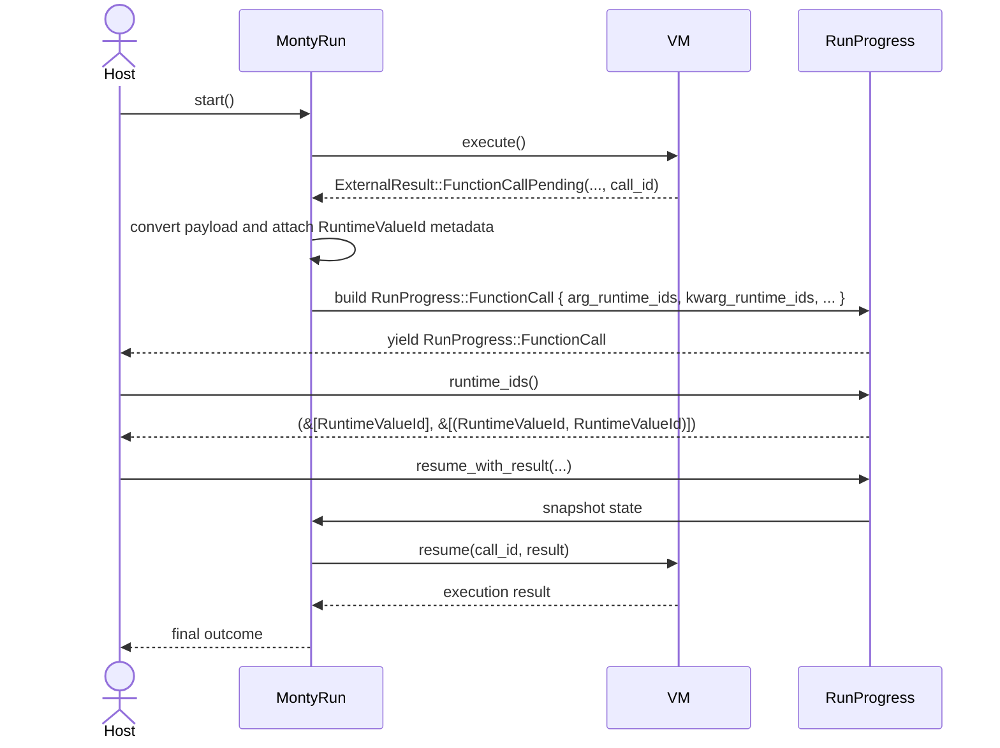

# Zamburak system design

This document is the authoritative system design for Zamburak.

This document defines semantics, invariants, trust boundaries, interfaces, and
verification expectations. It is intended to be detailed enough that an
implementer can build the system without making security-critical design
choices ad hoc.

Implementation sequencing belongs in `docs/roadmap.md`.

Proposed repository structure and file ownership mapping belong in
`docs/repository-layout.md`.

Engineering process and quality gates belong in
`docs/zamburak-engineering-standards.md` and `AGENTS.md`.

Technology and tooling baseline constraints are defined in
`docs/tech-baseline.md`.

Verification target matrices are defined in `docs/verification-targets.md`.

## Design context and motivation

Zamburak is built to address prompt-injection risk in agent systems that use
tools over sensitive data.

The core design motivation comes from two external observations:

- the CApabilities for MachinE Learning (CaMeL) research result in
  [Defeating Prompt Injections by Design](https://arxiv.org/abs/2503.18813)
  shows that tool-using agents can be made more robust by moving security
  enforcement out of prompt text and into runtime control- and data-flow
  enforcement,
- the Lethal Trifecta model in
  [The lethal trifecta for AI agents](https://simonwillison.net/2025/Jun/16/the-lethal-trifecta/)
   describes when real-world data theft becomes easy: private-data access,
  exposure to untrusted content, and external communication in the same agent
  workflow.

### What CaMeL contributes to this design

In the CaMeL paper, the defence model is a protective system layer around the
large language model (LLM), where control and data flows are tracked and tool
calls are policy-gated. The key significance for Zamburak is architectural:
security should be enforced by runtime semantics and policy checks, not by
hoping the model consistently ignores hostile instructions.

Zamburak adopts this direction in a Rust and Monty-oriented form:

- values carry dependency and label metadata through execution,
- side effects are checked against policy at tool boundaries,
- strict mode propagates control context into effect decisions.

### What the Lethal Trifecta contributes to this design

The Lethal Trifecta is the practical attacker model for agent deployments:

- access to private data,
- exposure to attacker-controlled or untrusted content,
- an output path that can communicate data externally.

Its significance is operational rather than theoretical: if all three
conditions exist, prompt injection can become direct data exfiltration. The
Zamburak design therefore prioritizes explicit containment and mediation of
those three conditions rather than generic prompt hardening.

### Design intent summary

Zamburak is not trying to make the underlying model perfectly trustworthy. It
is designed to make unsafe data and control flows mechanically visible and
policy-enforceable, so that high-risk effects can be blocked, drafted, or
confirmed with clear provenance.

## Terminology and naming glossary

This glossary is normative for design interpretation and naming consistency.

- CaMeL:
  shorthand for CApabilities for MachinE Learning, a research architecture that
  defends tool-using agents by enforcing policy at runtime control and
  data-flow boundaries, instead of relying on prompt-only instruction following.
- Lethal Trifecta:
  the attack-enabling condition set of private-data access, exposure to
  untrusted inputs, and external communication channels in one agent workflow.
- Monty:
  the Python interpreter from `pydantic/monty` used as the execution substrate
  for Zamburak plans. In this document, "Monty VM" means the `full-monty` fork
  plus generic instrumentation substrate, while policy and IFC semantics remain
  in Zamburak-owned crates.
- planner large language model (P-LLM):
  the model path used for trusted query decomposition and plan synthesis.
- quarantined large language model (Q-LLM):
  the isolated model path used for untrusted content transformation, always
  treated as untrusted output unless deterministic verification succeeds.
- authority token naming convention:
  use `UpperCamelCase` with Rust-compatible initialism casing, for example
  `EmailSendCap` and `LlmRemotePromptCap`.

## Goals and non-goals

### Product goal

Zamburak is a capability-governed execution environment for agent-authored
Monty programs. It reduces prompt injection impact by combining:

- dynamic information flow control (IFC),
- policy checks at every side effect boundary,
- deterministic verification and endorsement controls, and
- explicit confirmation for high-risk actions.

### Security property goal

The primary security goal is policy compliance under tracked dependencies:

- data from untrusted or sensitive origins is tracked through execution,
- every effectful external call is evaluated with argument summaries and
  control-context summaries, and
- uncertain analysis outcomes fail closed.

### Explicit non-goals

Zamburak does not claim:

- full non-interference across all observable channels,
- global control-flow integrity in the classic systems-security sense,
- protection against a compromised host OS or local malware,
- protection against exfiltration outside the runtime boundary.

## Security property taxonomy

This document uses these terms precisely:

- control-flow integrity (CFI): untrusted input cannot influence branching.
- non-interference: secrets do not influence attacker-observable behaviour.
- policy compliance: side effects are mediated by policy under conservative
  dependency tracking.

Zamburak targets policy compliance. Strict mode narrows side-channel exposure
by propagating control context into effect checks. It does not attempt to
enforce absolute CFI by default.

## Threat model and trust boundaries

### Attacker capabilities

The attacker can:

- control tool outputs, including email content, fetched pages, and document
  payloads,
- embed indirect instructions in untrusted content,
- exploit call occurrence and call count as side channels,
- exploit mutable or remote tool documentation if accepted at runtime,
- attempt taint laundering through concatenation, slicing, serialization,
  templating, or container mutation.

### Protected assets

Protected assets include:

- personal user content,
- authentication and authorization secrets,
- financial and account metadata,
- audit records,
- host-minted authority tokens.

### Trust boundaries

Zamburak defines these explicit boundaries:

- Monty runtime boundary: virtual machine (VM) values versus host side
  effects.
- tool boundary: Zamburak core versus tool adapters and Model Context Protocol
  (MCP) servers.
- large language model (LLM) boundary: local process versus upstream LLM
  providers.
- verification boundary: raw values versus verified and endorsed values.
- audit boundary: runtime state versus persisted, inspectable logs.

## Trusted computing base

Security claims rely on correctness of these trusted components:

- `full-monty` runtime substrate (stable runtime identity, generic observer
  hooks, snapshot extension seam),
- IFC propagation and dependency summarization logic,
- policy engine and policy loader,
- deterministic verifier and sanitizer implementations,
- authority token minting and validation,
- tool adapters, catalogue enforcement, and MCP trust classification,
- confirmation workflow for commit actions,
- redaction and audit persistence code.

Any bypass in these components invalidates policy-compliance claims.

## Architecture overview

Zamburak uses a layered virtual machine (VM) architecture: Monty executes
program semantics, while Zamburak overlays IFC and policy enforcement at all
effect boundaries.

### Two-track execution model

Zamburak follows an explicit two-track split:

- `Track A` (`full-monty`):
  generic runtime substrate only. This includes stable runtime IDs, generic
  observer events, and optional snapshot-extension bytes for embedder-owned
  state.
- `Track B` (Zamburak crates):
  opinionated governance semantics, including IFC propagation rules, policy
  decisions, approval and denial behaviour, sanitization requirements, and
  audit explanation payloads.

`Track A` and `Track B` share one normative membrane: external-function control
flow.

- `start()` and `resume()` define the host-mediated call boundary,
- `dump()` and `load()` define durability boundaries for governed execution
  state.

No Zamburak policy semantics may be implemented in `Track A` APIs. All policy
meaning is owned by `Track B`.

### `full-monty` fork governance contract

Track A governance is fail-closed and repository-local:

- `third_party/full-monty/` is pinned as a Git submodule so Track A state is
  explicit and auditable per superproject revision.
- Maintainers use `make monty-sync` to initialize the submodule, fast-forward
  fork branch state with upstream Monty, stage the pointer update, and run
  repository verification gates (`check-fmt`, `lint`, `test`).
- Allowed delta classes are limited to stable runtime IDs, generic observer
  hooks, optional generic snapshot extension, and narrowly enabling refactors.
- Added Track A API surface lines that include Zamburak semantic tokens are
  rejected by automated review policy checks.

The canonical process contract is defined in
[Monty fork policy](monty-fork-policy.md).

For screen readers: The following diagram shows trusted query flow entering the
planner, code running in Monty with IFC, and all side effects traversing policy
checks before tool execution and audit logging.


_Figure 1: Zamburak execution and effect mediation architecture._

### Component responsibilities

| Component                  | Responsibility                                 | Security-critical invariants                                                             |
| -------------------------- | ---------------------------------------------- | ---------------------------------------------------------------------------------------- |
| `full-monty` runtime layer | Executes code and emits generic runtime events | No bypass path around effect and value instrumentation in governed observer-enabled mode |
| IFC core                   | Tracks provenance, labels, and control context | Monotonic propagation and complete edge coverage                                         |
| Summary engine             | Produces bounded decision summaries            | Budget overflow produces unknown-top summary                                             |
| Policy engine              | Decides effect outcomes                        | Unknown state fails closed by default                                                    |
| Verifier framework         | Mints verified integrity labels                | Verification is deterministic and non-forgeable                                          |
| Tool adapter layer         | Executes external effects                      | Every effect requires policy decision                                                    |
| Catalogue manager          | Pins tool metadata and schemas                 | Runtime rejects mutable unpinned docs                                                    |
| Audit pipeline             | Produces reviewable records                    | Redacted summaries only by default                                                       |

_Table 1: Component responsibilities and security-critical invariants._

## Runtime semantics

### Supported language subset

Zamburak mode supports only Monty opcodes and built-ins with complete IFC
coverage. Unsupported operations must fail explicitly with structured errors.

An opcode coverage matrix is required and maintained as part of verification. A
missing propagation rule is treated as a security defect.

### Propagation modes

- `Normal`: propagate direct data dependencies.
- `Strict`: propagate direct data dependencies plus active control-context
  dependencies.

### Strict-mode effect semantics

Strict mode does not globally forbid branching on untrusted inputs. Instead,
strict mode requires every effectful call to include control-context summary in
policy evaluation.

In strict mode, all effect checks are evaluated over:

- argument summaries,
- control-context summary,
- effect history counters.

This closes classic leaks where constant arguments are used inside untrusted
conditionals.

### Container and mutation semantics

Mutable containers use versioned state semantics:

- each mutating operation creates a new container version,
- new container version depends on previous version and mutation input,
- reads depend on the observed container version,
- aliases share container identity while version increments over time.

This preserves DAG acyclicity while supporting mutation-heavy programs.

### Exception semantics and redaction

Exception text crossing trust boundaries is label-aware redacted:

- untrusted payload snippets are replaced with safe placeholders,
- sensitive values are replaced with tokenized references,
- repair-loop feedback to planner never includes raw hostile strings.

### Snapshot and resume semantics

Snapshots preserve:

- value identities,
- container version graph,
- label summaries,
- control-context state,
- policy-relevant counters needed for rate- and history-based checks.
- IFC state continuity across `start()` or `resume()` and `dump()` or `load()`
  boundaries, either through runtime-native persistence or versioned
  embedder-owned snapshot extension state.
- host-only runtime IDs for values crossing suspendable host boundaries.
  Runtime IDs are intentionally opaque and do not encode policy meaning.
- runtime ID continuity for both positional and keyword argument payloads
  emitted via Track A pause events in `run` and `repl` flows:
  `RunProgress::{FunctionCall, OsCall}` and
  `ReplProgress::{FunctionCall, OsCall}` with
  `arg_runtime_ids: Vec<RuntimeValueId>` and
  `kwarg_runtime_ids: Vec<(RuntimeValueId, RuntimeValueId)>`.

Restored execution must be semantically equivalent to uninterrupted execution
for policy evaluation outcomes.

_Runtime-ID flow across start, function-call yield, host inspection, and
resume._

For screen readers: The following diagram shows the runtime-ID flow across
start, function-call yield, host inspection, and resume.



Figure 5: Runtime-ID flow across start, function-call pause, host inspection,
and resume.

Implementation decision (2026-02-26): Task 0.5.1 uses `Value::id()` as the
runtime-ID substrate in `full-monty` and exposes it through additive,
host-facing payload fields. This keeps Track A generic and upstream-friendly
while providing continuity evidence across `start()` or `resume()` and `dump()`
or `load()`.

`ReplProgress::{FunctionCall, OsCall}` expose the same runtime-ID field shapes
and `runtime_ids()` accessor contract as `RunProgress`.

## Information flow model

### Three-axis label and authority model

Zamburak separates concepts that were previously conflated.

#### Integrity and provenance labels

Integrity expresses trust in value origin and transformation:

- `Integrity::Untrusted`,
- `Integrity::Trusted`,
- `Integrity::Verified(VerificationKind)`.

Only host-registered deterministic verifiers can mint
`Integrity::Verified(VerificationKind)`.

#### Confidentiality labels

Confidentiality labels describe leakage impact. Example labels include
personally identifiable information (PII):

- `PII`,
- `AUTH_SECRET`,
- `PRIVATE_EMAIL_BODY`,
- `PAYMENT_INSTRUMENT`,
- `INTERNAL_POLICY_NOTE`.

Confidentiality labels are independent of integrity labels.

#### Authority tokens

Authority is represented as host-minted capability tokens. Example tokens:

- `EmailSendCap`,
- `CalendarWriteCap`,
- `PaymentInitiateCap`,
- `LlmRemotePromptCap`.

Monty code cannot forge authority tokens.

#### Authority token lifecycle semantics

Authority tokens are stateful security objects. Their lifecycle rules are
normative:

- mint scope:
  only host-trusted components may mint tokens, and each token must encode
  subject, capability, scope, and expiry.
- delegation:
  delegated tokens must be strict subsets of parent scope and lifetime; parent
  provenance is retained for audit lineage.
- revocation:
  revocation is immediate at policy-evaluation boundaries using a host-managed
  revocation index; revoked tokens fail closed.
- expiry:
  expired tokens are invalid regardless of cached summaries and must be removed
  from effective authority sets before effect checks.
- snapshot restore validation:
  on restore, all tokens are revalidated against current revocation and expiry
  state; invalid tokens are stripped and any dependent effect request is denied
  or confirmation-gated conservatively.

Implementation decision (2026-02-13): authority token lifecycle semantics are
implemented in `crates/zamburak-core/src/authority.rs` as a self-contained
domain module. Key design choices:

- `TokenTimestamp` wraps `u64` and is injected by callers so all expiry
  evaluation is deterministic and testable without wall-clock dependencies.
- `AuthorityScope` uses `BTreeSet<ScopeResource>` for deterministic ordering
  and O(log n) subset checking; delegation requires strict (proper) subset
  narrowing, not merely non-widening.
- `RevocationIndex` is a simple `HashSet<AuthorityTokenId>` managed by the
  host; revocation is immediate at policy-evaluation boundaries and during
  delegation attempts.
- `AuthorityBoundaryValidation` partitions a token set into effective and
  invalid subsets with reasons, used both at policy boundaries and on snapshot
  restore (the two code paths share the same core validation to prevent
  divergence).
- `PolicyEngine::validate_authority_tokens` delegates to the canonical
  lifecycle validation in `zamburak-core` so the policy engine consumes
  lifecycle verdicts rather than duplicating transition logic.
- Delegation from a revoked or expired parent is rejected with
  `InvalidParentToken` before scope or lifetime narrowing checks run
  (fail-closed ordering).
- Delegation is rejected with `DelegationBeforeParentIssuance` if the
  delegation start time precedes the parent issuance time, preventing child
  tokens from granting authority before the parent became valid.
- Boundary validation treats pre-issuance tokens (evaluation time before
  `issued_at`) as invalid with reason `PreIssuance`, so future-dated tokens
  cannot be exercised early.

### Verification, endorsement, and declassification

Verification, endorsement, and declassification are separate:

- verification proves deterministic predicates,
- endorsement asserts trusted subsystem approval,
- declassification changes confidentiality visibility.

Verification does not remove confidentiality labels. Declassification requires
explicit policy and usually confirmation.

### Dependency representation

Zamburak uses two provenance tiers:

- fast path: O(1) label summary used in effect decisions,
- explain path: bounded witness graph used in explanations.

Budgets constrain graph growth and traversal. Budget exhaustion yields
unknown-top summary and conservative decisions.

## Data structures and interfaces

### Core runtime structures

The following structures define the minimum runtime model.

```rust
pub struct TaggedValue {
    pub id: ValueId,
    pub data: MontyValue,
    pub integrity: IntegrityLabel,
    pub confidentiality: DataLabels,
    pub authority: AuthoritySet,
    pub deps: SmallVec<[ValueId; 4]>,
}

pub struct ExecutionContextSummary {
    pub pc_integrity: IntegrityLabel,
    pub pc_confidentiality: DataLabels,
    pub control_dependencies: SmallVec<[ValueId; 8]>,
    pub effect_counters: EffectCounters,
}

pub struct DependencySummary {
    pub integrity_join: IntegrityLabel,
    pub confidentiality_join: DataLabels,
    pub authority_join: AuthoritySet,
    pub origin_count: u32,
    pub truncated: bool,
}
```

The field names above are normative at the semantic level. Concrete Rust type
names may differ if invariants are preserved.

### Core trait contracts

```rust
pub trait PolicyEngine {
    fn check(
        &self,
        tool: &ToolSignature,
        args: &[DependencySummary],
        ctx: &ExecutionContextSummary,
    ) -> PolicyDecision;
}

pub trait Verifier {
    fn verify(
        &self,
        input: &TaggedValue,
    ) -> Result<VerificationResult, VerificationError>;
}

pub trait ExternalFunction {
    fn signature(&self) -> &ToolSignature;
    fn call(&self, request: ToolRequest) -> Result<ToolResponse, ToolError>;
}
```

### Policy decision model

```rust
pub enum PolicyDecision {
    Allow(AuditRecord),
    Deny(DenyReason),
    RequireConfirmation(ConfirmationRequest),
    RequireDraft(DraftRequest),
}
```

Every non-allow decision must include machine-parseable reason codes and a
redacted explanation surface.

### Tool signature schema

Tool signatures are policy-governed contracts. A tool is effectful unless
declared pure and verified by adapter constraints.

```yaml
tool: send_email
version: 1
side_effect_class: ExternalWrite
required_authority: [EmailSendCap]
args:
  - name: to
    requires_integrity: Verified(AllowlistedEmailRecipient)
    allows_confidentiality: []
  - name: body
    forbids_confidentiality: [AUTH_SECRET]
    max_payload_bytes: 32768
context_requirements:
  forbid_pc_integrity: [Untrusted]
default_decision: RequireConfirmation
```

### Canonical policy schema v1

The canonical policy contract for Zamburak is `schema_version: 1`. All policy
files must parse into this schema before execution starts.

```yaml
schema_version: 1
policy_name: personal_assistant_default
default_action: Deny
strict_mode: true
budgets:
  max_values: 100000
  max_parents_per_value: 64
  max_closure_steps: 10000
  max_witness_depth: 32
tools:
  - tool: get_last_email
    side_effect_class: ExternalRead
    output_labels:
      integrity: Untrusted
      confidentiality: [PRIVATE_EMAIL_BODY]
    default_decision: Allow
  - tool: send_email
    side_effect_class: ExternalWrite
    required_authority: [EmailSendCap]
    arg_rules:
      - arg: to
        requires_integrity: Verified(AllowlistedEmailRecipient)
      - arg: body
        forbids_confidentiality: [AUTH_SECRET]
    context_rules:
      deny_if_pc_integrity_contains: [Untrusted]
    default_decision: RequireConfirmation
```

Schema v1 required top-level fields are:

- `schema_version`,
- `policy_name`,
- `default_action`,
- `strict_mode`,
- `budgets`,
- `tools`.

Implementation decision (2026-02-09): runtime loading entrypoints in
`crates/zamburak-policy/src/policy_def.rs` (`from_yaml_str` and
`from_json_str`) and engine constructors in
`crates/zamburak-policy/src/engine.rs` accept only `schema_version: 1`. Any
other version returns `UnsupportedSchemaVersion` and aborts policy loading.

### Schema compatibility and migration semantics

Compatibility rules for schema evolution are:

1. additive optional fields are compatible only if their default behaviour is
   not less restrictive than prior behaviour,
2. field removals, renames, enum widening, or default weakening are breaking
   changes and require a new schema version,
3. readers must reject unknown schema versions and fail closed.

Migration rules are:

- migrations are explicit, version-to-version transforms,
- each migration must preserve or tighten effective policy outcomes,
- migration execution and result hashes must be recorded in audit metadata,
- migration conformance tests are mandatory before adoption in the default
  profile.

Implementation decision (2026-02-10): runtime loading now supports one explicit
legacy migration path, `schema_version: 0` to `schema_version: 1`, before
canonical validation.

The v0-to-v1 transform maps legacy policy fields into canonical names:

- tool `name` to `tool`,
- tool `side_effect` to `side_effect_class`,
- tool `authority` to `required_authority`,
- tool rule `args[].name` to `arg`,
- tool rule `args[].forbid_confidentiality` to
  `forbids_confidentiality`,
- tool `context` to `context_rules`.

Unknown schema families remain fail-closed and return
`UnsupportedSchemaVersion`.

Migration audit metadata includes deterministic canonicalized SHA-256 hashes
for source and target documents, plus per-step hash evidence and transform
identifier (`policy_schema_v0_to_v1`).

Audit-bearing loader entrypoints are:

- `PolicyDefinition::from_yaml_str_with_migration_audit`,
- `PolicyDefinition::from_json_str_with_migration_audit`,
- `PolicyEngine::from_yaml_str_with_migration_audit`,
- `PolicyEngine::from_json_str_with_migration_audit`.

## Localization and user-facing diagnostics

Zamburak adopts the localization model defined in
`adr-002-localization-and-internationalization-with-fluent.md`: injection-first
localization with Fluent adapters, without ambient global state.

### Localization contract and ownership

- all user-facing localized text is rendered through an injected `Localizer`
  contract,
- the runtime provides `NoOpLocalizer` for deterministic fallback behaviour
  when no localization backend is configured,
- Zamburak publishes embedded localization assets so host applications can load
  Zamburak messages into their localization stack,
- locale negotiation and loader lifecycle ownership remain with the host
  application.

Zamburak must not read process locale environment variables directly and must
not maintain mutable process-wide localization singletons.

### Localized rendering semantics

Core domain `Display` output remains stable English for machine-stable logs and
test assertions. Localized user-facing diagnostics are exposed through explicit
rendering APIs that accept an injected `&dyn Localizer` plus caller fallback
copy.

Localized rendering must always preserve a deterministic output path when
translation lookup fails or localization is unavailable.

### Fallback and Fluent layering semantics

For Fluent-backed localization, message resolution order is:

1. host application catalogue entries,
2. Zamburak bundled entries for the requested locale,
3. Zamburak bundled `en-US` entries,
4. caller-provided fallback text.

Formatting failures, missing interpolation arguments, and malformed patterns
must emit structured diagnostics and continue through fallback resolution
rather than failing open or panicking.

For screen readers: The following diagram shows Fluent localization resolution
from host catalogue lookup through bundled fallbacks to caller-provided
fallback text, including formatting-failure handling.


_Figure 2: Fluent-backed message resolution and fallback flow._

### Fluent adapter integration profile

Fluent integration is optional and adapter-based:

- Fluent adapters consume a host-supplied `FluentLanguageLoader`,
- helper APIs load Zamburak embedded assets into caller-owned loaders,
- no adapter path may introduce ambient global localization state.

For screen readers: The following sequence diagram shows host-owned locale
negotiation, asset loading, localizer adapter construction, and localized
diagnostic rendering with fallback behaviour.


_Figure 3: Host-managed localization setup and diagnostic rendering sequence._

For screen readers: The following class diagram shows the localization trait
contracts, Fluent adapter composition, and host application ownership
boundaries.


_Figure 4: Localization contract and adapter class relationships._

### LocalizationArgs type at design-contract phase

The class diagram above shows `LocalizationArgs` as a parameter to `lookup()`
and `message()`. ADR-002 sketches this as `HashMap<&str, FluentValue<'a>>`,
which would couple `zamburak-core` to the `fluent-bundle` crate at the
design-contract phase. To avoid this coupling, the design-contract
implementation (Task 0.3.1) defines `LocalizationArgs<'a>` as
`HashMap<&'a str, String>`. The `FluentLocalizerAdapter` introduced in Phase 6
(Task 6.1.2) will convert `String` values to `FluentValue` internally, so
downstream consumers of the `Localizer` trait are unaffected by this
substitution.

## Policy evaluation semantics

### Inputs

Policy checks consume:

- tool signature,
- argument dependency summaries,
- execution-context summary,
- applicable global and per-tool budget state.

### Decision order

Policy rules evaluate in this order:

1. hard deny constraints,
2. authority token requirements,
3. verification requirements,
4. context constraints,
5. confirmation and draft requirements,
6. default action.

### Fail-closed rules

The engine must return `Deny` or `RequireConfirmation` when:

- tool signature is missing or unpinned,
- summary computation exceeds configured budgets,
- required label or authority information is unavailable,
- verifier result is absent for required verification kinds.

### Explanation contract

Every deny or confirmation decision includes:

- violated rule identifier,
- redacted dependency witness,
- concise remediation steps.

Explanation payloads must not contain raw untrusted text or raw secrets.

## Tool model and MCP integration

### Tool catalogue and pinning

Tools are loaded from a local catalogue with immutable entries:

- tool identifier,
- schema version,
- schema hash,
- documentation hash,
- trust classification,
- policy signature reference.

Runtime tool docs from remote sources are ignored unless hash-matching a pinned
entry.

### MCP server trust classes

MCP servers are classified as:

- `TrustedLocal`,
- `RemoteThirdParty`.

Each class has explicit capability budgets and allowed side effect classes.
Remote third-party servers default to stricter controls and reduced authority.

### Draft and commit action model

Irreversible operations use a two-phase model:

- draft phase prepares reviewable intent,
- commit phase executes side effect with additional policy evaluation.

Commit requests must reference the approved draft identifier and lineage.

## LLM interaction model

### Planner and quarantined processing

Zamburak supports a dual-path design:

- planner large language model (P-LLM): trusted query decomposition and plan
  synthesis,
- quarantined large language model (Q-LLM) or deterministic parser:
  transformation of untrusted tool outputs.

Q-path outputs are untrusted unless deterministically verified.

### LLM calls as exfiltration sinks

All LLM calls are treated as effectful sink calls with tool-like policy
signatures. Policy enforces:

- confidentiality budget per call,
- required minimization/redaction transforms,
- payload size and context limits,
- provider-specific approval requirements where configured.

### LLM sink enforcement architecture

LLM sink checks run at three explicit points:

1. pre-dispatch policy check in the runtime effect gateway, using argument and
   execution-context summaries,
2. adapter-level transport guard in the LLM tool adapter, ensuring required
   redaction and minimization transforms were applied,
3. post-dispatch audit emission in the audit pipeline with decision code,
   context summary reference, and payload-hash witness.

For planner and quarantined paths:

- P-LLM calls must pass policy before any remote prompt emission,
- Q-LLM calls are always tagged untrusted on response ingestion unless
  deterministic verification upgrades integrity,
- both paths emit linked audit records keyed by execution id and call id.

### Privacy boundary statement

Prompt injection resistance does not imply provider secrecy. If policy permits
sensitive labels into remote LLM prompts, disclosure risk remains.

## Audit and observability model

### Audit record schema

```yaml
timestamp: 2026-02-08T12:34:56Z
execution_id: exec_7f2c
call_id: call_0192
tool: send_email
decision: Deny
reason_code: CONFIDENTIALITY_FORBIDDEN
arg_summary_refs: [sum_33, sum_34]
context_summary_ref: ctx_12
witness_hash: sha256:...
redaction_applied: true
```

### Confidentiality-first defaults

Audit defaults:

- store summaries and hashes, not raw payload values,
- tokenize sensitive identifiers,
- redact untrusted free text,
- separate operational logs from policy evidence logs.

### Integrity and retention

Audit persistence requires:

- append-only record discipline,
- hash-chain integrity between successive records,
- configurable retention by age and size,
- controlled export path with explicit re-redaction checks.

## Policy visualization

### Motivation

Policy definitions are declarative YAML structures. As policies grow in
complexity — multiple tools, layered authority requirements, argument rules
with integrity and confidentiality constraints, and context rules — the
evaluation cascade becomes difficult to review by reading YAML alone. Automatic
generation of Mermaid flowchart diagrams from policy files provides a visual
representation of the decision flow for each tool, making policy review, audit,
and debugging faster and less error-prone.

### Generation approach

A code generator reads a canonical schema v1 policy definition and emits a
Mermaid `flowchart TD` diagram for each tool entry. The generated diagram
follows the same evaluation order documented in "Policy evaluation semantics"
above:

1. context rules (`deny_if_pc_integrity_contains`),
2. authority token requirements (`required_authority`),
3. integrity requirements (`requires_integrity` on each argument),
4. confidentiality restrictions (`forbids_confidentiality` on each
   argument),
5. default decision (`Allow`, `Deny`, `RequireConfirmation`, or
   `RequireDraft`).

Each stage that is present in the tool's policy produces a decision node in the
diagram. Stages that are absent (because the tool has no `context_rules`, for
example) are omitted, keeping the output concise.

A global summary diagram is also generated showing all tools organized by side
effect class (`ExternalRead` vs `ExternalWrite`) with their default decisions.

### Rendering with mmdr

Mermaid text is rendered to SVG or PNG using
[mmdr](https://github.com/1jehuang/mermaid-rs-renderer), a native Rust Mermaid
renderer. mmdr eliminates the browser dependency of the official `mermaid-cli`
and renders diagrams ~100–1400x faster than mermaid-cli (circa 3 ms per diagram
versus 2–3 s), making batch rendering of all policies in a repository practical
as a CI step.

The generation pipeline is:

1. parse policy YAML to `PolicyDefinition`,
2. emit Mermaid text per tool and per policy,
3. render via mmdr to SVG or PNG.

### Output artefacts

Generated diagrams are written to a configurable output directory. Suggested
defaults:

- `docs/generated/` for committed reference diagrams,
- CI artefacts for ephemeral per-run outputs.

Generated files must not be hand-edited. A header comment in each Mermaid
source file indicates that it was auto-generated and names the source policy
file.

### Integration points

- **CI**: diagram generation runs on every policy file change;
  rendering failures are merge-blocking.
- **Documentation**: the [policy examples](policy-examples.md)
  document demonstrates the style of diagram that the generator produces.
- **Audit**: generated diagrams can be attached to audit evidence
  packages to provide visual confirmation of the policy that was active during
  an audited execution.

## Verification and evaluation strategy

### Mechanistic correctness requirements

Required tests include:

- dependency monotonicity,
- no spontaneous verification,
- transitive closure correctness,
- strict-mode control-context propagation,
- container mutation and aliasing correctness,
- fail-closed behaviour on budget overflow,
- snapshot and resume equivalence.

### Security regression suite

Regression suite must cover:

- tool-call occurrence side channels,
- tool-call count side channels,
- taint laundering patterns,
- exception-text injection,
- mutable tool documentation injection,
- MCP trust-boundary bypass attempts.

### Differential and metamorphic testing

- differential tests compare behaviour with and without IFC for non-blocked
  programs,
- metamorphic tests assert label-equivalent outcomes under refactors such as
  variable renaming or independent statement reordering.

### End-to-end adversarial evaluation roadmap

Evaluation progression:

- minimum viable product (MVP): mechanistic suite plus curated adversarial
  corpus,
- next: model-in-loop benchmark integration, including AgentDojo-class tasks
  or equivalent,
- later: continuous red-team generation and trend tracking.

### Design-level acceptance criteria before phase 1 build-out

Before Phase 1 implementation begins, design-contract conformance tests must
exist and pass for:

- policy schema contract:
  parser and validator tests proving canonical schema v1 compatibility and
  fail-closed unknown-version handling.
- LLM sink enforcement:
  tests proving pre-dispatch checks, transport redaction enforcement, and audit
  linkage for both P-LLM and Q-LLM call paths.
- authority lifecycle:
  tests covering mint scope, delegation narrowing, revocation, expiry, and
  snapshot-restore revalidation behaviour.
- localization contract:
  tests proving explicit `Localizer` injection, deterministic fallback ordering
  (`host -> bundled locale -> bundled en-US -> caller fallback`), and absence
  of global mutable loader state.
- automation script baseline:
  tests proving roadmap-delivered scripts in `scripts/` (excluding helper
  modules and test files) use uv runtime metadata, follow Cuprum-first command
  invocation posture, and include matching tests in `scripts/tests/`.

If any contract conformance suite is missing or failing, phase-1 build work is
blocked.

### Automation script delivery baseline

Roadmap-delivered automation scripts are constrained by a delivery baseline to
keep operational tooling deterministic and reviewable.

- discovery rule:
  roadmap-delivered scripts are Python entrypoint files under `scripts/`,
  excluding underscore-prefixed helper modules and `scripts/tests/` content.
- runtime metadata:
  each roadmap-delivered script must include the uv shebang and uv metadata
  block with `requires-python = ">=3.13"` plus explicit dependencies.
- command invocation posture:
  scripts must not use Plumbum or ad hoc shell execution paths such as
  `subprocess`, `os.system`, or `os.popen`; command execution must follow
  Cuprum patterns from `docs/scripting-standards.md`.
- test pairing:
  each roadmap-delivered script must have a matching pytest file in
  `scripts/tests/` using the naming contract
  `scripts/tests/<relative_script_parent>/test_<script_stem>.py`.
- enforcement path:
  local and CI checks run `make script-baseline` and `make script-test`.

Repository CI enforces this phase-gate contract through `make phase-gate` and
the merge-blocking `phase-gate` workflow job. The advancement target is set in
`.github/phase-gate-target.txt`. When a mandated suite is missing or failing,
the gate fails closed and emits escalation actions aligned with
`docs/verification-targets.md`.

## Performance and resource model

### Resource budget classes

The design uses measurable budgets by class:

- virtual machine (VM) propagation overhead budget,
- policy decision latency budget,
- memory budgets for values, edges, and summaries,
- end-to-end agent step latency budget.

### Initial benchmark targets

| Budget                  | Target                                      | Measurement context                           |
| ----------------------- | ------------------------------------------- | --------------------------------------------- |
| VM propagation overhead | <= 200 ns/op p50                            | Representative opcode mix with labels enabled |
| Policy check latency    | <= 1 ms p95                                 | Argument summaries <= 100 origins             |
| Summary traversal       | <= 10,000 steps per check                   | Overflow forces unknown-top summary           |
| Memory growth           | linear in values with bounded witness state | Stress workload with mutation and loops       |

_Table 2: Initial performance budget targets and measurement contexts._

Targets are revised with empirical baselines but remain measurable and testable.

### Workload assumptions and service envelopes

Benchmark targets are interpreted against explicit workload assumptions:

- workflow profile:
  personal-assistant workloads with mixed read and write tools, bounded by 500
  effect checks per execution and 50,000 tagged values per run.
- side effect profile:
  at most 20 high-risk sink calls per execution requiring confirmation or draft
  mediation.
- mutability profile:
  container-heavy transformations with up to 10,000 mutation operations per
  execution.

Service-level indicators (SLIs) and service-level objectives (SLOs) are:

- SLI: p50 and p95 policy-check latency.
  SLO: p95 remains within the policy decision latency budget for supported
  summary sizes.
- SLI: VM opcode propagation overhead by representative opcode mix.
  SLO: p50 remains within the VM propagation overhead budget.
- SLI: proportion of executions ending in budget-overflow unknown-top states.
  SLO: overflow rate remains below 1 percent on representative workloads.

### Safety behaviour under pressure

When safety-relevant budgets are exceeded:

- summary state becomes unknown-top,
- policy decisions become conservative,
- runtime records explicit budget-overflow audit reasons.

## Scope boundaries

### In scope for the system design

This design covers:

- runtime semantics and invariants,
- IFC and policy interfaces,
- verification and authority model,
- tool and MCP trust boundaries,
- LLM sink governance,
- audit semantics,
- localization contracts for user-facing diagnostics in library deployments,
- evaluation requirements,
- policy visualization approach and tooling.

### Out of scope for this document

This document does not define:

- file-by-file implementation task lists,
- project-management sequencing details,
- user experience design for host application locale negotiation,
- continuous integration (CI) workflow mechanics beyond required security
  outcomes.

These concerns are tracked in `docs/roadmap.md` and
`docs/zamburak-engineering-standards.md`.

Repository path mapping and file-purpose documentation are tracked in
`docs/repository-layout.md`.

Technology baseline and verification target expectations are tracked in
`docs/tech-baseline.md` and `docs/verification-targets.md`.

## References

- Pydantic Monty: <https://github.com/pydantic/monty>
- CaMeL paper: <https://arxiv.org/abs/2503.18813>
- CaMeL reference implementation:
  <https://github.com/google-research/camel-prompt-injection>
- Simon Willison on the lethal trifecta:
  <https://simonwillison.net/2025/Jun/16/the-lethal-trifecta/>
- Simon Willison on CaMeL:
  <https://simonwillison.net/2025/Apr/11/camel/>
- Dromedary project: <https://github.com/microsoft/dromedary>
- [ADR 002 localization architecture](adr-002-localization-and-internationalization-with-fluent.md)
- Pydantic AI: <https://github.com/pydantic/pydantic-ai>
- mmdr (mermaid-rs-renderer):
  <https://github.com/1jehuang/mermaid-rs-renderer>
